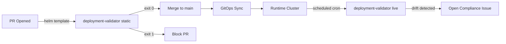

# deployment-validator Agent

Audits Kubernetes deployments, manifests, and cloud infrastructure against standards defined in `standards/claude-md/infra/CLAUDE.md` and `standards/claude-md/CLAUDE.md`. Generates structured compliance reports, prioritized remediations, machine-readable JSON summaries, and deterministic gate exit codes.

---

## Operational Modes

The agent operates in two distinct execution modes:

| Feature | Live Cluster Audit (`MODE: live`) | Static CI Manifest Gate (`MODE: static`) |
|---|---|---|
| **Primary Purpose** | Drift detection, runtime posture, scheduled compliance | Shift-left pre-commit & PR gates in CI/CD pipelines |
| **Input Source** | Live `kubectl`, `terraform show -json`, cloud CLI state | Rendered YAML (`helm template`, `kustomize build`) |
| **Execution Trigger** | Post-deployment triggers, weekly cron schedules | Pull requests (`pull_request`), pre-merge verification |
| **Missing Components** | Evaluated as `UNKNOWN` (missing evidence commands provided) | Evaluated as `N/A` (unrendered infra components ignored) |
| **Failure Policy** | Flags unverified/failed controls in audit report | Enforces `FAIL_LEVEL` (default `HIGH`); exits 1 on blocker |

### Live Cluster Audit (`MODE: live`)

Inspects active Kubernetes namespaces, Terraform state, or cloud provider telemetry. Evaluates live workloads for runtime drift and compliance. Incomplete telemetry evaluates to `UNKNOWN` alongside commands to extract missing evidence.

### Static CI Manifest Gate (`MODE: static`)

Scans multi-document Kubernetes YAML manifests rendered during CI prior to cluster application. Validates workload declarations against security, networking, and resilience baselines without requiring cluster access. Exits with code 1 upon discovering violations meeting or exceeding `FAIL_LEVEL` (default `HIGH`), directly halting pipeline promotion.

---

## What It Produces

Each validation run outputs a structured Markdown compliance report alongside a machine-readable JSON summary.

| Section | Description |
|---|---|
| **Overall Score** | `n/total controls passing (percentage%)` and N/A count |
| **Control Results** | Detailed tables per category: Security, Network, Resilience, Observability, Tagging, DR |
| **Failures & Warnings** | Specific violations with severity, resource identifier, risk analysis, and remediation snippets |
| **Unknown / N/A** | Controls with missing evidence (live mode) or omitted components (static mode) |
| **Remediation Priority** | Ranked action list ordered by risk severity and remediation effort |
| **Compliance Certificate** | Audit-trail statement suitable for compliance registers and release notes |
| **Machine-Readable Summary** | Standardized JSON block containing metrics and violations |

### Machine-Readable JSON Summary

Appended to the end of every evaluation report:

```json
{
  "version": "1.0.0",
  "mode": "live | static",
  "environment": "{env}",
  "service": "{service}",
  "timestamp": "{ISO 8601 timestamp}",
  "overall_result": "COMPLIANT | NON-COMPLIANT | PARTIALLY-COMPLIANT",
  "exit_code": 0,
  "fail_level": "CRITICAL | HIGH | MEDIUM",
  "summary": {
    "passed": 0,
    "failed": 0,
    "warned": 0,
    "unknown": 0,
    "not_applicable": 0,
    "total_evaluated": 0,
    "compliance_percentage": 0.0
  },
  "violations": [
    {
      "id": "SEC-001",
      "severity": "CRITICAL",
      "control": "Containers run as non-root",
      "resource": "Deployment/order-service",
      "finding": "Missing securityContext.runAsNonRoot",
      "remediation_available": true
    }
  ]
}
```

### Exit Code Contract

In automated pipelines and gate checks:

- **`exit 0` (Pass / Compliant)**: No violations with `severity >= FAIL_LEVEL`. Permitted results include `PASS`, `WARN`, `N/A`, and any `FAIL` strictly lower than `FAIL_LEVEL`.
- **`exit 1` (Fail / Non-Compliant)**: One or more violations detected with `severity >= FAIL_LEVEL`. Defaults:
  - `MODE: static`: default `FAIL_LEVEL: HIGH` (any `CRITICAL` or `HIGH` violation yields exit code 1, blocking PR promotion).
  - `MODE: live`: any unresolved `CRITICAL` or `HIGH` violation yields exit code 1 when evaluated as an automated deployment gate.

---

## Control Categories

| Category | Controls Checked |
|---|---|
| **Security (SEC)** | Non-root user, no privilege escalation, read-only root FS, capabilities dropped, no privileged/hostNetwork, ServiceAccount token disabled, no `latest` image, secrets via ExternalSecret |
| **Network (NET)** | NetworkPolicy present, default deny ingress/egress, no wildcard selectors, no public database |
| **Resilience (RES)** | PodDisruptionBudget, HPA, resource requests/limits, graceful shutdown |
| **Observability (OBS)** | Liveness/readiness probes, Prometheus scrape annotations |
| **Tagging (TAG)** | All 6 required labels, naming conventions |
| **DR & Backup (DR)** | Automated backups, PITR, cross-region replication (Tier 1), deletion protection |

---

## Preparing Evidence & Manifests

### Static Manifest Generation (Static Mode)

Render Kubernetes manifests prior to CI execution:

```bash
# Helm charts:
helm template order-service ./deploy/helm/order-service -f values-staging.yaml > manifest.yaml

# Kustomize overlays:
kustomize build overlays/staging > manifest.yaml
```

### Evidence Gathering (Live Mode)

Capture live cluster state and cloud telemetry:

```bash
NAMESPACE=order-service

kubectl get deployments -n $NAMESPACE -o yaml    > evidence/deployments.yaml
kubectl get pods -n $NAMESPACE -o yaml           > evidence/pods.yaml
kubectl get networkpolicies -n $NAMESPACE -o yaml > evidence/netpolicies.yaml
kubectl get hpa,pdb,sa -n $NAMESPACE -o yaml     > evidence/resources.yaml
kubectl get secrets -n $NAMESPACE               > evidence/secrets-list.txt

# Cloud & Terraform state:
terraform show -json > evidence/terraform-state.json
gcloud sql instances describe prod-acme-db --format=json > evidence/cloudsql.json
```

---

## How to Invoke

### Via Claude Code CLI

#### Static Manifest Gate

```bash
cat agents/deployment-validator/example-input-static.md | claude agent run deployment-validator
```

#### Live Cluster Audit

```bash
cat agents/deployment-validator/example-input.md | claude agent run deployment-validator
```

### Via Anthropic API (Python)

#### Static Mode (Rendered Manifests)

```python
import anthropic
import subprocess

def validate_rendered_manifest(chart_path: str, values_file: str, env: str = "staging") -> dict:
    with open("agents/deployment-validator/AGENT.md") as f:
        system_prompt = f.read()

    # Render Kubernetes manifest from Helm chart
    cmd = ["helm", "template", "order-service", chart_path, "-f", values_file]
    rendered_yaml = subprocess.check_output(cmd, text=True)
    indented_manifest = "\n".join(f"  {line}" for line in rendered_yaml.splitlines())

    client = anthropic.Anthropic()
    message = client.messages.create(
        model="claude-opus-4-6",
        max_tokens=8000,
        system=system_prompt,
        messages=[{"role": "user", "content": f"MODE: static\nFAIL_LEVEL: HIGH\nENVIRONMENT: {env}\nCLOUD: gcp\nSERVICE: order-service\nPROJECT: acme-payments\nDR_TIER: 1\nMANIFEST: |\n{indented_manifest}"}],
    )

    report = message.content[0].text
    passed = "Exit Code: 0" in report or '"exit_code": 0' in report
    return {"exit_code": 0 if passed else 1, "report": report}
```

#### Live Mode (Runtime Telemetry)

```python
import anthropic
import subprocess

def validate_deployment(namespace: str, environment: str, dr_tier: int) -> dict:
    with open("agents/deployment-validator/AGENT.md") as f:
        system_prompt = f.read()

    commands = [
        ("kubectl_get_deployments", f"kubectl get deployments -n {namespace} -o yaml"),
        ("kubectl_get_networkpolicy", f"kubectl get networkpolicies -n {namespace} -o yaml"),
        ("kubectl_get_pdb", f"kubectl get pdb -n {namespace} -o yaml"),
    ]
    evidence_blocks = []
    for ev_type, cmd in commands:
        try:
            out = subprocess.check_output(cmd.split(), stderr=subprocess.DEVNULL).decode()
            evidence_blocks.append(f"  - type: {ev_type}\n    content: |\n" + "\n".join(f"      {line}" for line in out.splitlines()))
        except subprocess.CalledProcessError:
            pass

    prompt = f"MODE: live\nENVIRONMENT: {environment}\nCLOUD: gcp\nSERVICE: {namespace}\nPROJECT: acme-payments\nDR_TIER: {dr_tier}\nEVIDENCE:\n" + "\n".join(evidence_blocks)
    client = anthropic.Anthropic()
    message = client.messages.create(
        model="claude-opus-4-6",
        max_tokens=8000,
        system=system_prompt,
        messages=[{"role": "user", "content": prompt}],
    )

    report = message.content[0].text
    return {"compliant": "NON-COMPLIANT" not in report, "report": report}
```

### Via GitHub Actions

#### Pull Request Static Gate (`manifest-compliance-gate.yml`)

Runs on pull requests modifying manifests or Helm charts, rendering templates with `helm template`, running static compliance checks, and blocking the PR if exit code is 1:

```yaml
# .github/workflows/manifest-compliance-gate.yml
name: Manifest Compliance Gate

on:
  pull_request:
    branches: [main]
    paths:
      - 'deploy/**'
      - 'charts/**'

jobs:
  static-manifest-gate:
    runs-on: ubuntu-latest
    steps:
      - uses: actions/checkout@v4
      - uses: azure/setup-helm@v4

      - name: Render Helm Chart Manifest
        run: |
          helm template order-service ./deploy/helm/order-service \
            -f ./deploy/helm/order-service/values.yaml > rendered.yaml

      - name: Run deployment-validator (Static Mode)
        id: validator
        uses: anthropics/claude-code-action@v1
        with:
          agent-system-prompt-file: agents/deployment-validator/AGENT.md
          prompt: |
            MODE: static
            FAIL_LEVEL: HIGH
            ENVIRONMENT: staging
            CLOUD: gcp
            SERVICE: order-service
            PROJECT: acme-payments
            DR_TIER: 1

            MANIFEST: |
              $(cat rendered.yaml)
          anthropic-api-key: ${{ secrets.ANTHROPIC_API_KEY }}

      - name: Enforce Exit Code Gate
        run: |
          echo "${{ steps.validator.outputs.result }}" > report.md
          if grep -q "Exit Code: 1" report.md || grep -q '"exit_code": 1' report.md; then
            echo "::error::Static manifest verification failed against infra standards (exit code 1)."
            exit 1
          fi
          echo "Manifests comply with all required controls."
```

#### Scheduled Weekly Audit (`compliance-audit.yml`)

Audits production cluster state on a scheduled cron cadence:

```yaml
# .github/workflows/compliance-audit.yml
name: Weekly Compliance Audit
on:
  schedule:
    - cron: '0 6 * * 1'
  workflow_dispatch:

jobs:
  audit-prod:
    runs-on: ubuntu-latest
    environment: production

    steps:
      - uses: actions/checkout@v4

      - uses: google-github-actions/auth@v2
        with:
          credentials_json: ${{ secrets.GCP_CREDENTIALS_READONLY }}

      - uses: google-github-actions/get-gke-credentials@v2
        with:
          cluster_name: prod-acme-payments-gke-cluster
          location: us-central1

      - name: Gather evidence
        run: |
          kubectl get deployments -n order-service -o yaml > deps.yaml
          kubectl get networkpolicies -n order-service -o yaml > netpol.yaml
          kubectl get hpa,pdb,sa -n order-service -o yaml > resources.yaml

      - name: Run compliance audit
        id: audit
        uses: anthropics/claude-code-action@v1
        with:
          agent-system-prompt-file: agents/deployment-validator/AGENT.md
          prompt: |
            MODE: live
            ENVIRONMENT: prod
            CLOUD: gcp
            SERVICE: order-service
            PROJECT: acme-payments
            DR_TIER: 1
            EVIDENCE:
              - type: kubectl_get_deployments
                content: $(cat deps.yaml | head -500)
              - type: kubectl_get_networkpolicy
                content: $(cat netpol.yaml)
              - type: kubectl_resources
                content: $(cat resources.yaml)
          anthropic-api-key: ${{ secrets.ANTHROPIC_API_KEY }}

      - name: Open issue if non-compliant
        if: contains(steps.audit.outputs.result, 'NON-COMPLIANT')
        uses: actions/github-script@v7
        with:
          script: |
            await github.rest.issues.create({
              owner: context.repo.owner,
              repo: context.repo.repo,
              title: `[Compliance] prod order-service NON-COMPLIANT - ${new Date().toISOString().split('T')[0]}`,
              labels: ['compliance', 'priority-high'],
              body: process.env.AUDIT_REPORT
            })
        env:
          AUDIT_REPORT: ${{ steps.audit.outputs.result }}
```

---

## Pipeline Composition



---

## Standards Enforced

| Control | Source |
|---|---|
| Container security context | `infra/CLAUDE.md` § Security Baselines → Kubernetes |
| NetworkPolicy structure | `infra/CLAUDE.md` § Security Baselines → Network |
| Required labels | `infra/CLAUDE.md` § Tagging and Labelling |
| Naming convention | `infra/CLAUDE.md` § Naming Conventions |
| PDB and HPA | `infra/CLAUDE.md` § Kubernetes Security |
| Liveness/readiness probes | `CLAUDE.md` § Observability |
| DR configuration | `infra/CLAUDE.md` § Disaster Recovery |
| Secret management | `CLAUDE.md` § Security → Non-Negotiables |
