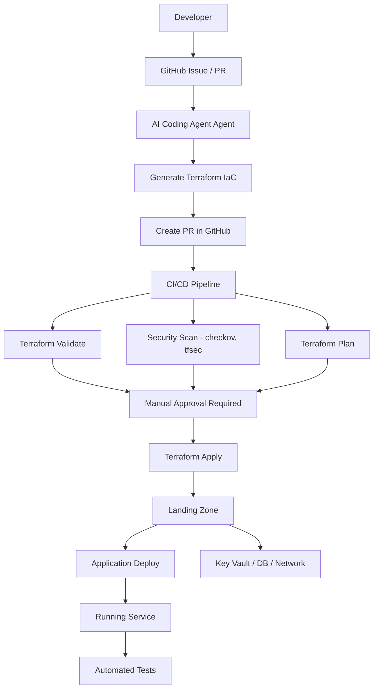
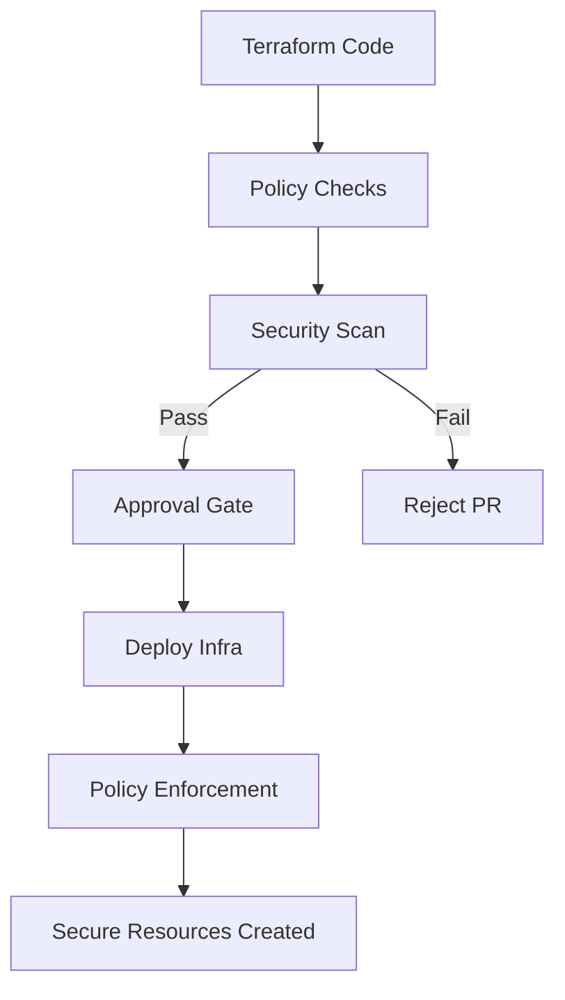

# 📦 Self-Service CI/CD Platform

## AI Coding Agent + GitHub + Terraform + Azure

---

# 🧠 Overview

This platform enables developers to **self-service infrastructure and deployments** without needing deep IaC knowledge, while enforcing **Regulatory compliance by design**.

Note this standard assumes that you will use AI coding agents such as Goose, Claude Code, Codex to build your infrastructure.

### Core Idea

* Developers **request services**
* AI Coding Agent generates Terraform
* GitHub manages workflow & approvals
* Terraform provisions infrastructure
* Azure hosts workloads
* Apps run as **Application (Python, Java, .NET) containers** on Container Apps

---

# 🏗️ Architecture Summary

## Platform Layers

### 1. Developer Interface

* GitHub Issues / PRs (initial)
* ChatOps (future: Teams / Slack)

### 2. Agent Layer

* AI Coding Agent generates IaC
* Enforces platform standards

### 3. CI/CD Layer

* Validation
* Security scanning
* Approval gates

### 4. Infrastructure Layer

* Terraform modules
* Azure/AWS/GCP landing zone

### 5. Runtime Layer

* Container Apps
* Private networking
* Managed identities

---

# 🔁 Self-Service Flow

## High-Level Steps

1. Developer requests a service
2. AI Coding Agent generates Terraform using approved modules
3. PR is created in GitHub
4. CI/CD runs validation + security checks
5. Manual approval (PCI requirement)
6. Terraform applies infrastructure
7. Application is deployed

---

# 🧱 Repository Structure

```text
platform-modules/ # Can be separated by stack
  ├── network/
  ├── container-app/
  ├── keyvault/

domain-infra/   # Infrastructure repo for each domain
  ├── modules/  # Any localized modules specific to the domain
  ├── envs/
  │    ├── dev/ #Environment specific tfvars and tf files
  │    └── prod/

service-templates/
  ├── api-service/
  ├── worker-service/
```

---

# 🔐 Regulatory compliance (Built-In)

## Key Controls

* Network segmentation (VNet, private endpoints)
* No public ingress for sensitive services
* Secrets via Secret manager only
* RBAC + Managed Identity
* Full audit trail via GitHub PRs
* Logging via Cloud Monitoring

## Enforcement

* Cloud Policies offered by provider
* Terraform scanning (Checkov / tfsec)
* Mandatory approvals in CI/CD
* Scan images (Defender / Trivy / Native Container Registry)

---

# 🤖 AI Coding Agent Responsibilities

* Generate Terraform from requests
* Enforce use of approved modules
* Prevent non-compliant configurations
* Create GitHub PRs automatically
* Assist developers (platform copilot)

---

# 🧪 Developer Experience

## Example Request

```text
New API Service:
- Name: payments-api
- Exposure: internal
- Database: postgres
```

## Outcome

* Terraform module generated
* PR created
* Infrastructure provisioned
* Application deployed

---

# 🚀 Evolution Roadmap

## Phase 1

* PR-based self-service
* AI Coding Agent generates IaC

## Phase 2

* GitHub Issues → structured requests

## Phase 3

* ChatOps (Teams / Slack)

## Phase 4

* Internal developer portal (Backstage-style)

---

# ⚠️ Key Principles

* Developers never write raw Terraform
* All infrastructure goes through approved modules
* Everything is auditable via GitHub
* Security and compliance are default

---

# 📊 Mermaid Diagrams

## 🧭 End-to-End Flow



---

## 🧱 Platform Architecture

```mermaid
flowchart LR
    Dev[Developer] --> GH[GitHub]
    GH --> AI_Coding_Agent[AI Coding Agent Agent]

    AI Coding Agent --> TF[Terraform]
    TF --> Cloud[Cloud Landing Zone]

    Cloud --> Net[Network (VNet/Subnets)]
    Cloud --> CA[Container Apps]
    Cloud --> KV[Key Vault]
    Cloud --> DB[Database]

    CA --> App[Application (Python, Java, .NET) App]

    KV --> App
    DB --> App
```

---

## 🔐 Regulatory Compliance Control Flow



---

# 🏁 Final Summary

This platform provides:

* ✅ Self-service developer experience
* ✅ Regulatory compliance by default
* ✅ Full auditability via GitHub
* ✅ Scalable platform architecture
* ✅ Extensible AI-driven automation via AI Coding Agent

---

## 💡 Strategic Insight

This is effectively an **Internal Developer Platform (IDP)** where:

* Platform team defines guardrails
* Developers self-serve safely
* AI accelerates infrastructure delivery

---
