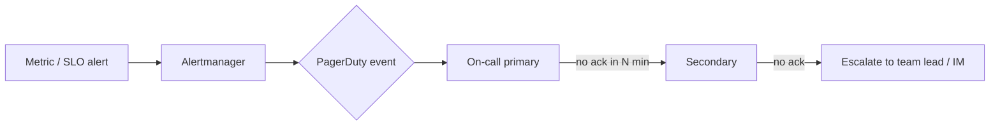

# Alerting & On-Call

Standards for **alerting philosophy**, **severity and routing**, **escalation**, **PagerDuty integration**, **runbooks**, and **on-call operations** — so alerts are actionable, routed to the right human, and never noise.

---

## Alerting Philosophy

**An alert should represent user impact (or imminent user impact), and every alert must be actionable by the person it pages.**

- If an alert fires and the recipient cannot or need not act → it is **noise**, and should be deleted or converted to a ticket/dashboard.
- **Page on user impact** (SLO burn rate — see [SLI/SLO](./sli-slo.md)), not on raw sensor thresholds that don't map to users.
- **Alerts point to truth**: each alert links to the right dashboard and a runbook with the first diagnostic step.
- Prefer **a small number of high-signal alerts** over a large number of fragile rules.

---

## Alert Sources (all feed one routing layer)

| Source | Examples | Notes |
|--------|----------|-------|
| Metrics | Prometheus / cloud-native metrics | Primary; burn-rate & resource alerts |
| SLO | Burn-rate alerts (14.4×/6×/1×) | Highest signal |
| Logs | Select error-rate / anomaly patterns | Secondary, keep sparse |
| Synthetic | Uptime / API / browser checks | Independent of instrumentation (see [Synthetic & RUM](./synthetic-rum.md)) |
| Health | Liveness/readiness, missing metrics | Watchdog style ("peer is down / silent") |
| Trace-based | High error rate in traces | Sometimes requires APM-specific alerting |

---

## Severity Model

| Severity | Page? | Response | Examples |
|----------|-------|----------|----------|
| **SEV-1 (Critical)** | Yes — page immediately | ≤15 min | User-impacting outage, SLO burning at 14.4×+, payment failures |
| **SEV-2 (High)** | Yes — page | ≤1 hr | Significant error rate, dependency down, degraded but serving |
| **SEV-3 (Warning)** | No page — notify channel | business hours | High latency trending, capacity warnings, budget approaching |
| **SEV-4 (Info / ticket)** | No | next working day | Non-critical drift, long-window budget risk, non-urgent capacity |

---

## Alert Routing & On-Call

### Routing model
1. **Alerts → routing rules** (by `service`, `team`, `environment`) → **on-call rotation** of the owning team.
2. **Escalation**: primary → secondary → manager / incident commander → major-incident responder.

### On-call rotation (best practice)
- Dedicated on-call shifts (e.g., 1 week), at least 2 named people per shift (primary + secondary).
- **No persistent on-call.** Rotate; keep time off real.
- A single human is the **primary** for a service team; the secondary covers if the primary doesn't respond in N min.
- **Follow-the-sun** for global teams where volume/coverage justifies it.

### Acknowledgement & clearance
- Alert stays in "fired" until **resolved by the condition clearing or by the runbook's verification**, not merely acknowledged.
- Follow-ups (long-running tickets) auto-created from non-resolving conditions.

---

## PagerDuty Integration

PagerDuty is the reference **on-call / incident-response** platform. Standards for wiring alerts to PagerDuty:

| Concern | Standard |
|---------|----------|
| Alert → service | Each team/application maps to a PagerDuty **service** keyed by `service.name` |
| Severity mapping | Prometheus/OTel severity → PagerDuty priority (Critical/High/…) |
| Routing | By service/team so the right on-call receives it |
| Dedupes | **Dedup keyed on `service + alert name`** to collapse flapping alerts |
| Escalation policy | Teams define primary → secondary → manager escalate (with timeouts) |
| Acknowledgement | On-call ACKs within target; auto-escalate if not |
| Integrations | Versatile/new-relic/datadog/cloud-native → PagerDuty; also **Genie/cloud-native** equivalents allowed |
| Event orchestration | Route different alert types (metrics vs synth vs logs) to differing policies if useful |

### Prometheus → Alertmanager → PagerDuty (reference flow)


```yaml
# alertmanager config (excerpt)
route:
  group_by: ['service']
  receiver: 'pagerduty'
  routes:
    - matchers: [ 'severity = critical' ]
      receiver: 'pagerduty-critical'
      group_wait: 30s
...
receivers:
  - name: pagerduty-critical
    pagerduty_configs:
      - service_key: '<service_key>'
        severity: 'critical'
        url: 'https://events.pagerduty.com/v2/enqueue'
```

---

## Runbooks

**Every alert links to a runbook** — the first page of triage. A runbook contains:

1. **Alert meaning** — what triggered, what it indicates
2. **Impact** — which users/business flows are affected
3. **Diagnostic steps** — ordered commands, links to the exact dashboard/log query/trace
4. **Remediation** — fix actions (rollback, scale, toggle, restart)
5. **Escalation path** — who to call if not resolved
6. **Post-incident** — what to capture for the retrospective

```markdown
# High Error Rate — order-service

## Alert meaning
Error rate > 5% for 2+ minutes (or SLO burn at 14.4x).

## Impact
Failures placing orders for affected users/routes.

## Diagnostics
1. Open the order-service SLO dashboard (link) — confirm burn rate.
2. Check error breakdown by route/status.
3. `kubectl logs -l app=order-service --tail=200` filter by trace_id from a failing span.
4. Check dependent services (auth, postgres) health.

## Remediation
1. Recent deploy? Rollback.
2. Dependency down? Verify circuit breaker + failover.
3. Saturation? Scale horizontally.

## Escalation
- Slack: #order-service-alerts
- PagerDuty: Order Service rotation
```

Runbooks are **versioned as code** next to the service, same repo, reviewed on PR.

---

## Key Alerts Every Service Must Have

| Alert | Source | Severity |
|-------|--------|----------|
| **SLO burn** (14.4×/6×/1×) | SLO/burn-rate | Critical/Warning |
| **High error rate** | metrics (RED) | Warning→Critical |
| **High latency (p99)** | metrics | Warning |
| **Saturation** (CPU/mem/thread pool/queue) | metrics (USE) | Warning |
| **Dependency down** (downstream/DB) | metrics, synthetic | Critical |
| **Missing** (peer silent / no metrics) | watchdog | Critical |
| **Synthetic check failure** | synthetic | Critical (see [Synthetic & RUM](./synthetic-rum.md)) |
| **Circuit breaker open** | metrics | Warning |

---

## Alert Hygiene

| Alarm | Standard |
|-------|----------|
| Review | Alert rules reviewed quarterly; dead/unactionable ones deleted |
| Flapping | Handled by dedupe + `for:` duration, not by silencing real alerts |
| Test | Alerts tested (fired in test env) before going live |
| Noise budget | Track alert-per-incident; high noise → fix the rule or the system |
| Actionable | Every SEV-1/2 alert answers: what to do, in the runbook |

---

## On-Call Operations Standards

| Practice | Requirement |
|----------|-------------|
| Rotation | Scheduled, rotating, ≥2 per shift; no permanent on-call |
| Coverage | Follow-the-sun or guaranteed SLAs for response times |
| Escalation | Written policies; timeouts defined; secondary auto-roll |
| Response SLAs | SEV-1 ≤15 min, SEV-2 ≤1 hr |
| Handoff | Documented shift handoff (open incidents, known issues) |
| Incident comms | Dedicated channel; status page for user-facing incidents |
| Post-incident | Blameless retrospective → action items tracked |

---

## Anti-Patterns

| Anti-Pattern | Problem | Solution |
|--------------|---------|----------|
| Page every threshold | Noise, alert fatigue, ignored pages | Page on SLO burn-rate & user impact |
| Unowned alert | Nobody acts | Route to owning team rotation |
| No runbook | On-call wastes time figuring out | Every alert links to a runbook |
| Persistent on-call (same person) | Burnout | Rotating shifts with backup |
| No escalation | One-person dependency | Defined primary→secondary→manager |
| Acknowledge ≠ resolve | Incident left open silently | Clearance rules + follow-up tickets |

---

[← Back to Observability README](./README.md)
