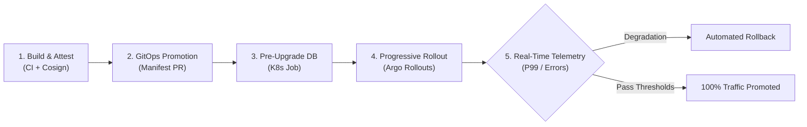

# Release Engineering & Progressive Delivery Standards

Standards for **continuous deployment, GitOps reconciliation, telemetry-driven canary promotions, decoupled database migrations, and cryptographic software supply chain integrity**.

---

## Documents

| Standard | What It Covers |
|---|---|
| [Progressive Delivery](./progressive-delivery.md) | Canary & blue-green traffic shifting, stepped traffic increments, real-time telemetry analysis, and instant automated rollback |
| [GitOps Promotions](./gitops-promotions.md) | Multi-repository GitOps topology, environment promotion pipelines, pull-based reconciliation engines, automated drift detection, and self-healing runtime state |
| [Database Migrations](./database-migrations.md) | Schema lifecycle, decoupled migrations via Kubernetes pre-upgrade Jobs, dual-version backward compatibility (expand-contract), and zero-downtime execution |
| [Supply Chain Security](./supply-chain-security.md) | Keyless Cosign signing via OIDC, SLSA Level 3 provenance attestations, automated vulnerability scanning gates, and Kyverno admission controls |

---

## Where to Start

**Rolling out canary or blue-green traffic shifting?** Go to [Progressive Delivery](./progressive-delivery.md) for traffic slicing, bake windows, and telemetry-driven automated rollback.

**Designing GitOps pipelines or multi-environment promotion?** Go to [GitOps Promotions](./gitops-promotions.md) for repository topologies, pull-based reconciliation engines, and drift self-healing.

**Evolving database schemas without application downtime?** Go to [Database Migrations](./database-migrations.md) for decoupled pre-upgrade jobs and expand-contract dual-version compatibility.

**Hardening artifact provenance and admission security?** Go to [Supply Chain Security](./supply-chain-security.md) for keyless image signing, SLSA Level 3 attestations, and admission policy enforcement.

---

## Guiding Principles

1. **Decouple deployment from release.** Deploying code to infrastructure must never be synonymous with exposing features to 100% of end users. Route traffic progressively and control feature visibility independently.
2. **Metric-driven verification over manual checks.** Human inspection cannot keep pace with continuous delivery. Automated rollout controllers must evaluate objective telemetry thresholds (error rates, P95/P99 latencies) to govern step promotions and instant rollbacks.
3. **Declarative configuration with flexible delivery.** Declare the desired state of infrastructure, workloads, and delivery strategies in version control. Support pull-based GitOps reconciliation alongside hardened push-based and managed cloud delivery pipelines where required.
4. **Dual-version backward compatibility.** Database schema migrations and service APIs must remain compatible across adjacent versions ($N$ and $N+1$). Use expand-contract patterns and decouple migrations into standalone pre-upgrade jobs so canary pods and stable pods coexist safely.
5. **Cryptographic provenance and zero-trust supply chain.** Verify every artifact from commit to cluster. Enforce keyless container signing, generate verifiable SLSA provenance, and gate deployments with fail-closed Kubernetes admission controllers.
6. **Blast radius containment.** Limit production exposure to minimal initial traffic slices (e.g., 5%) and isolate failures to bounded workloads, preventing localized defects from cascading into systemic outages.

---

## Delivery Models Overview

Modern release engineering supports three distinct delivery models based on operational constraints, infrastructure hosting, and security boundaries:

### 1. Pull-Based GitOps

- **Mechanism:** In-cluster agents (e.g., ArgoCD, Flux) continuously monitor Git manifest repositories and pull state changes into the target cluster.
- **Drift Handling:** Continuously reconciles live cluster state against declared Git manifests; detects out-of-band changes and automatically self-heals or alerts.
- **Security Profile:** Zero inbound firewall ports or long-lived cluster administrative credentials exposed to external CI runners.
- **Best Suited For:** Kubernetes-native production environments, high-compliance clusters, and multi-tenant platforms practicing continuous reconciliation.

### 2. Push-Based CD with OIDC-Scoped Ephemeral Credentials

- **Mechanism:** Centralized CI/CD runners (e.g., GitHub Actions, GitLab CI) push workloads to target environments using short-lived OpenID Connect (OIDC) identity federation (AWS IAM via OIDC, GCP Workload Identity, Azure Workload Identity).
- **Credential Model:** Eliminates static, long-lived API tokens and service account keys in favor of short-lived, least-privilege identity federation scoped directly to repository, branch, and environment.
- **Security Profile:** Ephemeral session credentials minimize blast radius of runner compromise while providing audited access.
- **Best Suited For:** Multi-cloud deployments, VM/serverless workloads, hybrid platforms, and cross-system deployment orchestration.

### 3. Managed Cloud Delivery Pipelines

- **Mechanism:** Cloud provider-native continuous delivery services (e.g., Google Cloud Deploy, AWS CodePipeline, Azure Delivery Plans) orchestrate multi-target release progressions.
- **Governance:** Built-in promotion targets (dev -> staging -> prod), provider-managed approval workflows, native IAM integration, and immutable release artifacts.
- **Security Profile:** Centralized cloud audit logging, provider-managed IAM boundary enforcement, and zero control-plane operational overhead.
- **Best Suited For:** Teams deeply embedded in specific cloud provider ecosystems seeking fully managed delivery pipelines with minimal infrastructure maintenance.

---

## Progressive Release Lifecycle

---

## Core Delivery Gates

Production releases must pass four deterministic verification gates:

1. **Static Manifest Audit:** Manifests pass `deployment-validator --mode=static` prior to promotion PR merge.
2. **Cryptographic Attestation:** Container images carry Cosign signatures and SLSA provenance validated at admission.
3. **Decoupled Migration Run:** Schema changes complete successfully via standalone Kubernetes pre-upgrade Jobs.
4. **Telemetry Analysis:** Canary progression evaluates continuous metric thresholds (HTTP error rates < 0.1%, P99 latency within baseline).

---

## Related Standards

- [CI/CD Pipeline](../cicd-pipeline.md) — Build, test, container packaging, and pipeline triggers.
- [Observability Standards](../observability/README.md) — RED/USE metrics, Prometheus alerting, and distributed tracing powering release analysis gates.
- [Microservices](../microservices.md) — Service boundaries, health check contracts, and graceful shutdown handling.
- [Data Architecture](../data/README.md) — Database per service, isolation, and schema evolution patterns.
- [DevOps Standards](../../overall/devops.md) — Deployment frequency, lead time, and operational engineering culture.
- [Supply Chain Security](./supply-chain-security.md) & [Security Checklist](../../overall/checklists.md#security--compliance-checklist) — Admission controls, image signing, and security scanning policies.
