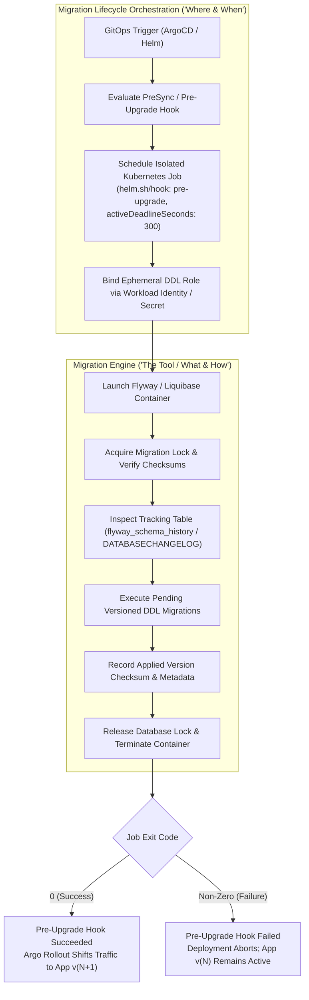
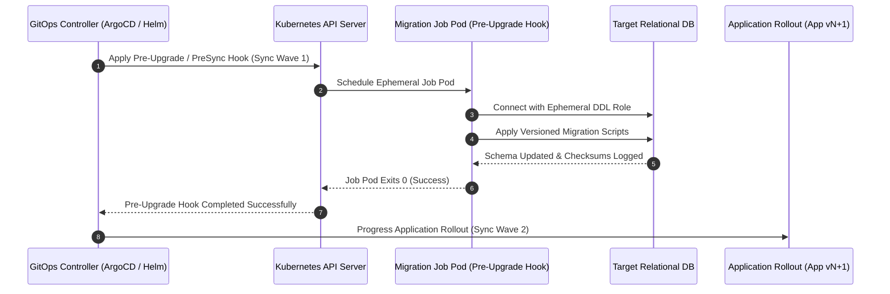
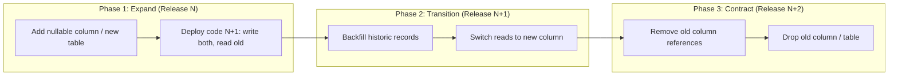

# Database Migration Standards

Standards for automated, zero-downtime database schema migrations in continuous delivery pipelines.

## What are Automated Database Migrations?

Automated database migrations are programmatic, version-controlled transitions of relational database schema state executed deterministically within continuous delivery pipelines. Rather than relying on manual DBA scripts or error-prone runbooks, migration scripts are versioned alongside application source code, packaged into immutable container artifacts, and executed via automated deployment hooks to guarantee schema parity across development, staging, and production environments without downtime.

## Why it's required

- **Zero-Downtime Continuous Delivery:** Relational schema alterations must deploy continuously without maintenance windows, locking outages, or dropped in-flight transactions.
- **Blast Radius Containment:** Migration failures halt the deployment pipeline before application pods are altered or traffic shifts occur, keeping stable version $N$ workloads untouched.
- **Elimination of Concurrency Deadlocks:** Running migrations inside application pod startup sequences causes distributed lock contention and connection pool exhaustion across replica sets.
- **Dual-Version Compatibility:** Workloads undergo rolling updates where active application version $N$ and rolling version $N+1$ interact simultaneously against the same physical schema.
- **Auditability & Drift Prevention:** Every schema modification runs through peer-reviewed pull requests, executes under least-privilege credentials, and records immutable checksums in tracking tables.

## Who it's for

- **Platform & SRE Teams:** Engineers standardizing Kubernetes pre-upgrade job hooks, GitOps synchronization waves, execution timeouts, and automated rollback boundaries.
- **Application Developers:** Software engineers authoring idempotent SQL migration scripts and implementing backward-compatible expand/contract schema evolutions.
- **Database Administrators (DBAs):** Technical leads reviewing query execution plans, concurrent indexing strategies, lock timeouts, and transactional DDL boundaries.
- **Security Engineers:** Auditors verifying credential boundaries between unprivileged runtime DML connections and ephemeral, least-privilege migration DDL roles.

---

## Separation of Concerns: Migration Engine vs Migration Orchestration

A resilient database deployment architecture strictly decouples **migration execution engines** from **platform lifecycle orchestration**. Conflating these responsibilities leads to startup race conditions, privilege bloat, and deployment deadlocks.

### Migration Engine vs Migration Lifecycle

- **Migration Engine ("The Tool / What & How"):**
  - **Tooling:** Flyway, Liquibase, Alembic, Goose, Atlas.
  - **Responsibilities:** Manages raw SQL execution, computes cryptographic file checksums, records applied versions in schema history tracking tables (e.g., `flyway_schema_history`, `DATABASECHANGELOG`), enforces execution ordering, and manages transactional DDL boundaries where supported by the database engine.
- **Migration Lifecycle ("The Standard / Where & When"):**
  - **Platform Standards:** Kubernetes PreSync/pre-upgrade Job hooks, ArgoCD sync waves, Helm lifecycle hooks, cloud IAM workload federation.
  - **Responsibilities:** Defines the isolated execution context (ephemeral, single-pod Kubernetes Job with dedicated migration IAM identity), execution timing (strictly pre-traffic shift and before application container rollout), backward compatibility contracts (two-phase Expand/Contract schema evolution), database locking limits, and automated failure recovery/abort thresholds.

| Dimension | Migration Engine ("The Tool / What & How") | Migration Lifecycle ("The Standard / Where & When") |
|---|---|---|
| **Primary Scope** | SQL/DDL execution, schema version calculation, checksum verification, and transactional boundaries. | Deployment sequencing, execution context, IAM boundaries, compatibility contracts, and failure handling. |
| **Tooling & Standards** | Flyway, Liquibase, Alembic, Goose. | Kubernetes PreSync/pre-upgrade Jobs, ArgoCD, Helm, AWS IAM / GCP Workload Identity. |
| **Execution Context** | Ephemeral runner container executing inside an isolated pod. | Single-runner Kubernetes Job decoupled from long-lived application replica sets. |
| **Execution Timing** | Executes sequentially at container boot against the database. | Executes strictly **pre-traffic shift** during deployment sync waves, prior to rolling out version $N+1$ pods. |
| **Authentication & IAM** | Receives database host, port, credentials, or token from environment. | Enforces least-privilege DDL credentials via short-lived Workload Identity; application pods retain DML-only credentials. |
| **State Tracking** | In-database tracking table (`flyway_schema_history`, `DATABASECHANGELOG`). | Git revision history, Helm release status, and ArgoCD synchronization state. |
| **Compatibility Contract** | Validates SQL syntax and script completion. | Enforces two-phase Expand/Contract patterns ensuring concurrent version $N$ and $N+1$ operational safety. |
| **Failure & Recovery** | Emits non-zero exit codes on syntax, lock, or constraint failures. | Aborts GitOps sync wave; cancels Argo Rollout / Helm upgrade; leaves running version $N$ pods active and healthy. |

### Architectural Boundary: Hook Orchestration & Engine Execution

The following diagram illustrates how the platform migration lifecycle orchestrates the execution of the Flyway/Liquibase migration engine inside an isolated Kubernetes pre-upgrade Job hook:



### Production Kubernetes Migration Job Manifest (Flyway Engine)

The following manifest demonstrates the lifecycle standard orchestrating a Flyway migration engine container within a decoupled Kubernetes pre-upgrade Job hook:

```yaml
apiVersion: batch/v1
kind: Job
metadata:
  name: order-service-migration
  namespace: order-workloads
  annotations:
    helm.sh/hook: pre-upgrade
    helm.sh/hook-weight: "-5"
    helm.sh/hook-delete-policy: hook-succeeded,before-hook-creation
    argocd.argoproj.io/hook: PreSync
    argocd.argoproj.io/hook-delete-policy: HookSucceeded
    argocd.argoproj.io/sync-wave: "1"
spec:
  activeDeadlineSeconds: 300
  backoffLimit: 1
  template:
    metadata:
      labels:
        app.kubernetes.io/name: order-service-migration
        app.kubernetes.io/component: db-migration
    spec:
      restartPolicy: Never
      serviceAccountName: order-service-migration-sa
      securityContext:
        runAsNonRoot: true
        runAsUser: 65534
        runAsGroup: 65534
        fsGroup: 65534
        seccompProfile:
          type: RuntimeDefault
      containers:
        - name: flyway-migrator
          image: flyway/flyway:10.10.0-alpine
          imagePullPolicy: IfNotPresent
          command: ["flyway"]
          args:
            - "-url=jdbc:postgresql://$(DB_HOST):5432/$(DB_NAME)"
            - "-user=$(DB_USER)"
            - "-password=$(DB_PASSWORD)"
            - "-locations=filesystem:/flyway/sql"
            - "-connectRetries=10"
            - "-lockRetryCount=5"
            - "migrate"
          env:
            - name: DB_HOST
              valueFrom:
                configMapKeyRef:
                  name: order-service-config
                  key: DB_HOST
            - name: DB_NAME
              value: "order_db"
            - name: DB_USER
              valueFrom:
                secretKeyRef:
                  name: order-service-migration-secret
                  key: MIGRATION_USER
            - name: DB_PASSWORD
              valueFrom:
                secretKeyRef:
                  name: order-service-migration-secret
                  key: MIGRATION_PASSWORD
          volumeMounts:
            - name: migration-scripts
              mountPath: /flyway/sql
              readOnly: true
          resources:
            requests:
              cpu: 100m
              memory: 128Mi
            limits:
              cpu: 500m
              memory: 512Mi
          securityContext:
            allowPrivilegeEscalation: false
            readOnlyRootFilesystem: true
            capabilities:
              drop:
                - ALL
      volumes:
        - name: migration-scripts
          configMap:
            name: order-service-migration-sql
```

---

## Key Business Drivers

| Driver | Outcome |
|--------|---------|
| **Zero Downtime** | Schema changes deploy continuously without taking offline applications or rejecting user traffic |
| **Blast Radius Containment** | Migration failures abort releases early before application pods are altered or restarted |
| **Race Condition Elimination** | Centralized, single-execution runners eliminate concurrent migration conflicts across replica sets |
| **Bidirectional Compatibility** | Dual-version compatibility ensures active version $N$ and rolling version $N+1$ function simultaneously |
| **Auditability & Traceability** | Schema updates run through version-controlled, auditable GitOps delivery pipelines |

---

## Core Principles

### 1. Decoupled Schema Lifecycle

Database schema state transitions must be decoupled from application container boot sequences. Schema changes constitute distinct release lifecycle events governed by independent transactional boundaries, verification checks, and rollback strategies.

- Schemas migrate ahead of application deployments, never alongside or after container restarts.
- Migration assets reside in version-controlled migration files (e.g., Flyway, Liquibase, Alembic, Goose).
- Each migration script must be immutable once merged to the primary branch.

### 2. Zero In-Process Application Auto-Migrations

Executing migrations inside application containers during startup (e.g., ORM auto-migrate, `db.AutoMigrate()`, `flyway.migrate()` in application entrypoint) is **strictly forbidden** in production environments.

**Risks of In-Process Migrations:**

- **Distributed Lock Contention**: When a Deployment scales out multiple replicas concurrently, all pods compete for migration locks, inducing startup timeouts and database connection exhaustion.
- **Rollout Death Spirals**: A migration error causes every container in the replica set to crash-loop, bringing down existing stable replicas during rolling updates.
- **Privilege Bloat**: Runtime application containers require restricted Data Manipulation Language (DML) permissions (`SELECT`, `INSERT`, `UPDATE`, `DELETE`). Auto-migrations require Data Definition Language (DDL) permissions (`ALTER`, `CREATE`, `DROP`), violating least-privilege principles.

---

## Hook-Based Execution Architecture

Schema changes execute inside ephemeral, single-runner Kubernetes Jobs orchestrated by GitOps deployment hooks. The deployment pipeline enforces strict synchronization ordering so that database migrations run and terminate cleanly before rolling out new application workloads.

### GitOps Hook Synchronization Flow



### Alternative Engine Manifest: Liquibase Pre-Upgrade Job Hook

For services standardizing on Liquibase as their migration engine, the following Kubernetes Job manifest demonstrates execution within the pre-upgrade hook lifecycle:

```yaml
apiVersion: batch/v1
kind: Job
metadata:
  name: order-service-liquibase-migration
  namespace: order-workloads
  annotations:
    helm.sh/hook: pre-upgrade
    helm.sh/hook-weight: "-5"
    helm.sh/hook-delete-policy: hook-succeeded,before-hook-creation
    argocd.argoproj.io/hook: PreSync
    argocd.argoproj.io/hook-delete-policy: HookSucceeded
    argocd.argoproj.io/sync-wave: "1"
spec:
  activeDeadlineSeconds: 300
  backoffLimit: 1
  template:
    metadata:
      labels:
        app.kubernetes.io/name: order-service-migration
        app.kubernetes.io/component: db-migration
    spec:
      restartPolicy: Never
      serviceAccountName: order-service-migration-sa
      securityContext:
        runAsNonRoot: true
        runAsUser: 65534
        runAsGroup: 65534
        fsGroup: 65534
        seccompProfile:
          type: RuntimeDefault
      containers:
        - name: liquibase-migrator
          image: liquibase/liquibase:4.27.0-alpine
          imagePullPolicy: IfNotPresent
          command: ["liquibase"]
          args:
            - "--changelog-file=db/changelog/db.changelog-master.yaml"
            - "--url=jdbc:postgresql://$(DB_HOST):5432/$(DB_NAME)"
            - "--username=$(DB_USER)"
            - "--password=$(DB_PASSWORD)"
            - "update"
          env:
            - name: DB_HOST
              valueFrom:
                configMapKeyRef:
                  name: order-service-config
                  key: DB_HOST
            - name: DB_NAME
              value: "order_db"
            - name: DB_USER
              valueFrom:
                secretKeyRef:
                  name: order-service-migration-secret
                  key: MIGRATION_USER
            - name: DB_PASSWORD
              valueFrom:
                secretKeyRef:
                  name: order-service-migration-secret
                  key: MIGRATION_PASSWORD
          volumeMounts:
            - name: changelog-volume
              mountPath: /liquibase/db/changelog
              readOnly: true
          resources:
            requests:
              cpu: 100m
              memory: 128Mi
            limits:
              cpu: 500m
              memory: 512Mi
          securityContext:
            allowPrivilegeEscalation: false
            readOnlyRootFilesystem: true
            capabilities:
              drop:
                - ALL
      volumes:
        - name: changelog-volume
          configMap:
            name: order-service-liquibase-changelog
```

---

## Fault Isolation & Blast Radius Containment

Migration failures must never compromise cluster availability or corrupt operational state.

### Failure Semantics & Guardrails

1. **`activeDeadlineSeconds: 300`**: Hard execution ceiling enforced at the Kubernetes API level. If migrations block on table locks or slow index generation past 5 minutes, Kubernetes terminates the pod immediately.
2. **`backoffLimit: 1`**: Strict limit preventing cyclic retries. If a migration step fails, running it repeatedly risks corrupting partially applied non-transactional changes. Fail immediately to allow engineering triage.
3. **Rollout Abort on Failure**:
   - In ArgoCD, a failed `PreSync` hook halts the sync phase immediately before syncing main application manifests.
   - In Helm, a failed `pre-upgrade` hook aborts the release; application pods running version $N$ continue servicing traffic unaffected.
4. **Dedicated DDL Credentials**: The migration job authenticates with a short-lived, DDL-capable database user via Workload Identity or external secrets. Runtime application containers maintain unprivileged DML connections.

---

## Expand/Contract Migration Pattern

To ensure zero downtime, all schema modifications must follow the two-phase **Expand/Contract** (Parallel Run) architectural pattern. Version $N$ and version $N+1$ must operate concurrently against the database without errors.



### Transition Phases

1. **Phase 1: Expand (Non-Breaking Additions)**
   - Schema additions are purely additive: add nullable columns, new tables, or non-exclusive views.
   - Never add non-nullable columns without sensible default values.
   - Application version $N$ ignores new columns and continues normal operation.
2. **Phase 2: Transition (Dual-Writing & Backfilling)**
   - Application version $N+1$ is deployed.
   - Application begins writing to both old and new schema constructs (or writing exclusively to new constructs if backward compatibility allows).
   - Asynchronous background jobs backfill historical records to conform to the new structure.
   - Read paths switch from old columns to new columns once data parity is verified.
3. **Phase 3: Contract (Deprecation & Clean-up)**
   - Deployed when version $N$ is completely decommissioned across all environments.
   - Unused legacy columns, tables, triggers, and temporary views are dropped via standard migration jobs.

### Safe vs Dangerous Schema Operations

| Operation | Direct Modification (Anti-Pattern) | Safe Expand/Contract Alternative |
|-----------|-----------------------------------|----------------------------------|
| **Rename Column** | `ALTER TABLE tbl RENAME COLUMN a TO b;` (Breaks active version $N$) | Add column `b`, dual-write from code, backfill historical rows, switch reads to `b`, drop `a` in subsequent release |
| **Drop Column** | `ALTER TABLE tbl DROP COLUMN a;` (Breaks queries in flight) | Remove references to `a` in code release $N+1$. Drop column `a` in release $N+2$ |
| **Add NOT NULL** | `ALTER TABLE tbl ADD COLUMN a INT NOT NULL;` (Fails if table has rows) | Add column `a` as nullable. Backfill existing rows with defaults. Alter column to `NOT NULL` |
| **Add Index** | `CREATE INDEX idx_name ON tbl(col);` (Locks table against writes) | Use concurrent execution: `CREATE INDEX CONCURRENTLY idx_name ON tbl(col);` (PostgreSQL) |
| **Change Data Type** | `ALTER TABLE tbl ALTER COLUMN a TYPE bigint;` (Rewrite lock) | Add new column `a_new` with target type, sync via trigger/dual-write, backfill, cut over |

---

## Remediation & Rollback Procedures

When an ephemeral migration job fails, automated deployment pipelines halt before touching production application pods. Engineers must follow deterministic incident response protocols to remediate:

### 1. Pre-Deployment Abort Triage

- **Status Assessment**: Confirm that active application pods running version $N$ remain healthy and unimpacted by evaluating rollout status and synthetic health probes.
- **Log Extraction**: Query migration job logs (`kubectl logs job/<service>-migration -n <namespace>`) to isolate the failure root cause (e.g., lock acquisition timeout, constraint conflict, syntax error).
- **Lock Contention Inspection**: Inspect active database lock queries (e.g., `pg_stat_activity`, `sys.dm_tran_locks`) for stalled transactions holding exclusive table locks that caused the job to exceed `activeDeadlineSeconds: 300`.

### 2. Forward-Fix vs Down Migration Protocol

- **Forward-Fix by Default**: Downward migrations (`migrate down`) are strictly prohibited in production once partial data operations occur. Always roll forward by authoring a compensatory, backward-compatible migration script.
- **Transactional DDL Boundaries**: Where supported by the database engine (e.g., PostgreSQL), enclose migration statements in atomic transactions (`BEGIN ... COMMIT;`) so that errors automatically revert schema state, preventing partial migration locks.
- **Non-Transactional Safeguards**: On engines lacking DDL transactions (e.g., MySQL, CockroachDB for multi-statement DDL), each script must be strictly idempotent to allow safe re-execution following operational intervention.

---

## Operational Verification & Standards Checklist

Prior to approving any migration pull request, verify conformance against the following gates:

- [ ] **Decoupled Job**: Migrations are packaged in dedicated migration images executed via Kubernetes PreSync/pre-upgrade Jobs.
- [ ] **Bounded Limits**: Job manifests explicitly declare `activeDeadlineSeconds: 300` and `backoffLimit: 1`.
- [ ] **Resource Budgets**: Ephemeral jobs specify explicit CPU and memory requests and limits.
- [ ] **Non-Blocking DDL**: All index creation uses online or concurrent algorithms (`CONCURRENTLY` in PostgreSQL, `ONLINE=ON` in MySQL/SQL Server).
- [ ] **Lock Timeouts**: Migration scripts declare aggressive session-level lock timeouts (e.g., `SET lock_timeout = '5s'`) to prevent blocking operational traffic.
- [ ] **Forward & Backward Compatibility**: Changes verify that application version $N$ and $N+1$ can run simultaneously without regression.
- [ ] **Idempotent Execution**: Migration scripts use safe guards (`IF NOT EXISTS`, transactional boundaries where supported).
