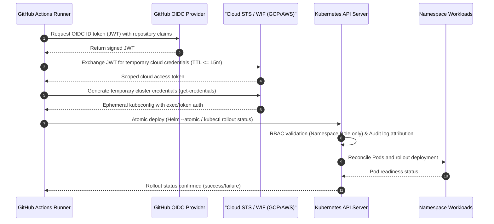
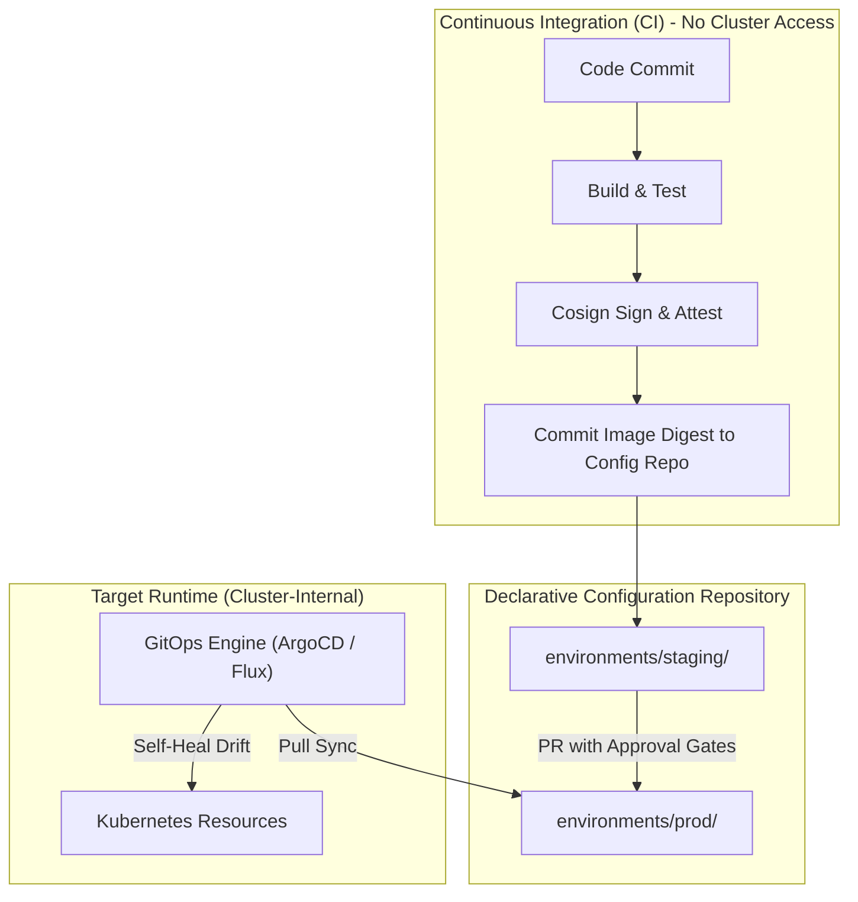
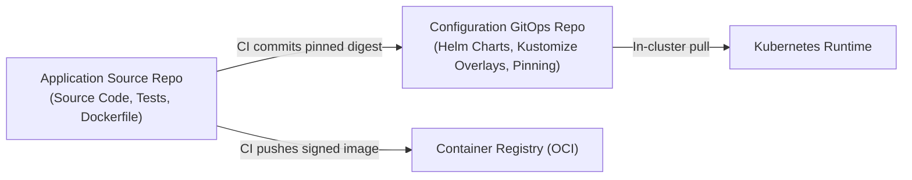

# GitOps Promotion & Environment Progression Standards

Standards for declarative configuration management, multi-environment promotion pipelines, and GitOps delivery workflows.

## What is GitOps Promotion?

GitOps promotion is the practice of managing application and infrastructure state declaratively in Git repositories and orchestrating multi-environment progression (such as development, staging, and production) through version-controlled commits and pull requests. Rather than executing manual updates or running push commands from continuous integration pipelines, an automated reconciliation engine continuously synchronizes runtime environments to match the desired state declared in version control.

Promotions represent deterministic transitions between environments where artifacts (container image digests, configuration parameters, resource topologies) are verified in lower environments and progressed to higher environments via immutable, auditable Git commits.

## Why it's required

- **Immutable Audit Trail:** Every promotion, configuration change, and rollback is recorded in Git commit history with author identity, review approvals, and cryptographic signatures.
- **Drift Detection & Self-Healing:** Prevents manual, out-of-band runtime mutations from desynchronizing production environments by continuously reconciling actual state back to declared state.
- **Elimination of Static Cluster Credentials:** Eliminates the need to grant long-lived administrative cluster credentials (`kubeconfig` or service account keys) to external CI runners.
- **Deterministic Rollbacks:** Enables instant, zero-downtime rollbacks via standard `git revert` commands that restore the last-known stable configuration within seconds.
- **Strict Separation of Concerns:** Separates the continuous integration phase (build, test, container signing) from deployment authorization and environment configuration.

## Who it's for

- **Platform & Infrastructure Engineers:** Designing multi-environment cluster topologies, configuring GitOps reconciliation controllers, and enforcing cluster security baselines.
- **Software Engineers & Application Teams:** Managing environment configurations, promoting service releases, and maintaining service-level manifests.
- **Release Engineers & SREs:** Establishing promotion criteria, approval gates, progressive canary analysis, and disaster recovery procedures.
- **Security & Compliance Auditors:** Verifying deployment provenance, enforcing separation of duties, and validating zero static credentials in external pipelines.

---

## Delivery Model Decision Guide: Pull vs. Push vs. Managed

While pull-based GitOps is the **recommended default for Kubernetes workloads**, modern delivery architectures support three primary patterns depending on target infrastructure, security requirements, and operational maturity.

### 1. Pull-Based GitOps (ArgoCD / Flux)

- **Mechanism:** An in-cluster reconciliation operator continuously polls or receives webhooks from Git repositories and synchronizes live cluster state to declared manifests.
- **Network & Credential Posture:** Zero inbound firewall pinholes to cluster API servers. Read-only Git access credentials reside inside the cluster; no cluster credentials leave the cluster security perimeter.
- **Drift Handling:** Continuous active drift detection and automated self-healing restore declared state within 60 seconds of out-of-band mutation.
- **Trade-offs:** Higher initial cluster resource overhead; requires managing in-cluster controllers, CRDs, and cluster permissions.

### 2. Push-Based CD with OIDC Ephemeral Credentials (GitHub Actions / GitLab CI)

- **Mechanism:** External pipeline runners authenticate directly to cloud providers or Kubernetes clusters using short-lived OpenID Connect (OIDC) identity tokens exchanged for scoped, temporary cloud IAM credentials via Workload Identity Federation (WIF).
- **Network & Credential Posture:** Strict prohibition of static tokens, service account JSON keys, and permanent `kubeconfig` files. Credentials expire automatically (maximum 1 hour). Requires cluster API endpoint reachability from runner networks (or private self-hosted runners).
- **Drift Handling:** Point-in-time enforcement only during pipeline runs. No continuous background drift remediation.
- **Trade-offs:** Simpler operational footprint with no in-cluster controllers to maintain; unified pipeline tooling across heterogeneous targets, but exposes the cluster API to external networks and lacks automatic self-healing.

### 3. Managed Cloud Pipelines (Google Cloud Deploy / AWS CodeDeploy / Azure Pipelines)

- **Mechanism:** Cloud-provider-managed delivery orchestration service executes declarative deployment progression, environment promotions, and canary traffic stepping across managed target runtimes (e.g., GKE, Cloud Run, ECS, AKS).
- **Network & Credential Posture:** Uses native cloud provider IAM role delegation and centralized audit logging (e.g., Cloud Audit Logs, AWS CloudTrail). Control plane managed entirely by the cloud provider.
- **Drift Handling:** Varies by provider; typically point-in-time validation with optional post-deployment health verification, but does not provide continuous declarative drift reconciliation.
- **Trade-offs:** Zero control-plane management burden; built-in enterprise promotion approval workflows and release rendering; trade-off is provider coupling and reduced portability across multi-cloud environments.

### Comparative Decision Matrix

| Dimension | Pull-Based GitOps (ArgoCD / Flux) | Push-Based CD (OIDC / WIF) | Managed Cloud Pipelines (Cloud Deploy / CodeDeploy) |
|---|---|---|---|
| **Security Model** | In-cluster pull; zero inbound cluster API access; no cluster credentials exposed to external CI. | External push via short-lived OIDC tokens ($\le 1\text{ hr}$); zero static credentials or permanent `kubeconfig`. | Cloud-native IAM role delegation; managed control plane with unified provider audit trails. |
| **Operational Complexity** | High (managing in-cluster CRDs, controller upgrades, multi-cluster agent topologies). | Low to Medium (standard runner configuration, no in-cluster management agents). | Low (fully serverless, vendor-managed promotion control plane and approval workflows). |
| **Target Workloads** | Kubernetes clusters (EKS, GKE, AKS, bare-metal), service meshes, and CRD-based resources. | Serverless functions, static websites, VM fleets, heterogeneous non-Kubernetes platforms. | Managed cloud compute services (GKE, Cloud Run, ECS, Lambda, Azure App Services) within target cloud. |
| **Failure Domains** | Decentralized per cluster/management plane; CI runner downtime does not halt cluster sync or rollbacks. | Centralized in CI platform; runner outages or network breaks prevent releases and hotfixes. | Centralized in cloud provider delivery service; decoupled from build runner failures. |
| **Best Fit** | **Recommended default for Kubernetes workloads** requiring continuous drift self-healing and zero ingress. | Serverless, edge, or hybrid environments without dedicated Kubernetes platform engineering teams. | Single-cloud enterprise deployments seeking managed promotion gates without hosting GitOps controllers. |

### Hardened Push-Based CD Implementation (OIDC & Ephemeral Credentials)

When push-based deployment is selected, platform teams must eliminate static cluster credentials, enforce strict least-privilege RBAC, and constrain token lifetimes. The hardened push pattern authenticates external CI runners via OpenID Connect (OIDC) identity federation, receives ephemeral tokens, and executes atomic deployments with immediate health verification.

#### Architectural Pattern: Ephemeral OIDC Credential Exchange

Push-based deployment must avoid static `kubeconfig` files or long-lived cloud service account keys stored in CI repository secrets. Instead, runners exchange cryptographically signed OIDC tokens for short-lived cloud credentials, generate temporary cluster credentials, and execute atomic rollouts.



The credential exchange sequence operates across four tightly governed phases:

1. **OIDC JWT Minting**: The CI runner requests an OpenID Connect ID token signed by GitHub's Token Service, embedding cryptographic claims (`repository`, `workflow`, `actor`, `ref`, `job_workflow_ref`).
2. **Cloud STS Federation**: The cloud Security Token Service (Google Cloud Workload Identity Federation or AWS IAM with GitHub OIDC identity provider) verifies the token signature, validates repository claim constraints, and issues short-lived cloud credentials with a TTL ceiling of $\le 15\text{ minutes}$ (900 seconds).
3. **Cluster Credential Scoping**: CI retrieves temporary Kubernetes access credentials targeting the designated cluster, generating a localized `kubeconfig` valid only for the duration of the job step.
4. **Atomic Deployment & Verification**: CI executes an atomic deployment (`helm upgrade --atomic` or `kubectl apply -k` paired with `kubectl rollout status`), blocking until pods achieve readiness or triggering automatic rollback on degradation.

#### Complete Production GitHub Actions Workflow Manifest

The following production workflow demonstrates a hardened push deployment using Google Cloud Workload Identity Federation and GKE (interchangeable with AWS IRSA and EKS). It enforces concurrency serialization, ephemeral credential scoping, and atomic rollout verification:

```yaml
name: Production Push Deployment

on:
  push:
    branches:
      - main
    paths:
      - 'deploy/helm/**'
      - 'environments/prod/**'

permissions:
  id-token: write # Mandatory for requesting the GitHub OIDC JWT
  contents: read  # Minimal repository checkout permission

concurrency:
  group: production-deploy
  cancel-in-progress: false # Prevent overlapping deployments or broken state transitions

jobs:
  deploy-production:
    name: Deploy to Production Cluster
    runs-on: ubuntu-latest
    environment:
      name: production
      url: https://api.prod.example.com/healthz
    timeout-minutes: 15

    steps:
      - name: Check out configuration repository
        uses: actions/checkout@v4

      - name: Authenticate to Google Cloud via OIDC (WIF)
        id: auth
        uses: google-github-actions/auth@v2
        with:
          workload_identity_provider: 'projects/123456789012/locations/global/workloadIdentityPools/github-pool/providers/github-provider'
          service_account: 'cd-deployer@prod-infra-project.iam.gserviceaccount.com'
          token_format: 'access_token'
          access_token_lifetime: '900s' # Ephemeral TTL <= 15 minutes

      - name: Retrieve Ephemeral GKE Cluster Credentials
        uses: google-github-actions/get-gke-credentials@v2
        with:
          cluster_name: 'prod-core-gke'
          location: 'us-central1'
          project_id: 'prod-infra-project'

      - name: Set up Helm 3
        uses: azure/setup-helm@v4
        with:
          version: 'v3.16.2'

      - name: Atomic Deploy & Rollout Verification (Helm)
        run: |
          helm upgrade --install core-api ./deploy/helm/core-api \
            --namespace production-workloads \
            --values ./environments/prod/values.yaml \
            --set image.digest="${{ github.sha }}" \
            --atomic \
            --timeout 5m \
            --wait

      # Alternative Kustomize / kubectl atomic pattern:
      # - name: Deploy with Kustomize and Rollout Verification
      #   run: |
      #     kubectl apply -k ./environments/prod
      #     kubectl rollout status deployment/core-api -n production-workloads --timeout=300s
```

#### Kubernetes RBAC Scoping Manifest

To prevent CI runner compromise from escalating to cluster takeover, external CI credentials must be bound to a dedicated, namespace-restricted Kubernetes ServiceAccount and Role. The following manifest demonstrates strict least-privilege scoping:

```yaml
apiVersion: v1
kind: ServiceAccount
metadata:
  name: cd-deployer-sa
  namespace: production-workloads
  annotations:
    # Bound to cloud IAM principal via Workload Identity / IRSA
    iam.gke.io/gcp-service-account: "cd-deployer@prod-infra-project.iam.gserviceaccount.com"
---
apiVersion: rbac.authorization.k8s.io/v1
kind: Role
metadata:
  name: cd-workload-deployer
  namespace: production-workloads
rules:
  # Workload execution and controller resources
  - apiGroups: ["apps"]
    resources: ["deployments", "statefulsets"]
    verbs: ["get", "list", "watch", "create", "update", "patch", "delete"]
  # Core application resources strictly scoped to namespace
  - apiGroups: [""]
    resources: ["services", "configmaps", "secrets"]
    verbs: ["get", "list", "watch", "create", "update", "patch", "delete"]
  # Schema migration and one-shot tasks
  - apiGroups: ["batch"]
    resources: ["jobs"]
    verbs: ["get", "list", "watch", "create", "update", "patch", "delete"]
  # Autoscaling policies
  - apiGroups: ["autoscaling"]
    resources: ["horizontalpodautoscalers"]
    verbs: ["get", "list", "watch", "create", "update", "patch", "delete"]
  # High availability and resilience policies
  - apiGroups: ["policy"]
    resources: ["poddisruptionbudgets"]
    verbs: ["get", "list", "watch", "create", "update", "patch", "delete"]
  # Ingress and network security perimeter
  - apiGroups: ["networking.k8s.io"]
    resources: ["networkpolicies", "ingresses"]
    verbs: ["get", "list", "watch", "create", "update", "patch", "delete"]
---
apiVersion: rbac.authorization.k8s.io/v1
kind: RoleBinding
metadata:
  name: cd-workload-deployer-binding
  namespace: production-workloads
subjects:
  - kind: ServiceAccount
    name: cd-deployer-sa
    namespace: production-workloads
roleRef:
  apiGroup: rbac.authorization.k8s.io
  kind: Role
  name: cd-workload-deployer
```

> [!CAUTION]
> **Mandatory Privilege Boundaries & Explicit Denials**:
>
> 1. **Zero `cluster-admin` Privileges**: Under no circumstances may CI deployment identities be bound to the `cluster-admin` ClusterRole or assigned cluster-level mutating authority via `ClusterRoleBinding`.
> 2. **Deny Cluster-Scoped Resources**: External CI runners must never possess RBAC authorization over cluster-scoped primitives, including `Nodes`, `PersistentVolumes`, `StorageClasses`, `Namespaces`, or `CustomResourceDefinitions` (CRDs).
> 3. **Deny RBAC Escalation**: Deployment roles must explicitly omit access to `rbac.authorization.k8s.io` resources (`Roles`, `RoleBindings`, `ClusterRoles`, `ClusterRoleBindings`), preventing compromised CI runners from modifying permissions or escalating privileges.

#### Mandatory CI Push Security Guardrails

Organizations operating push-based CD must enforce four non-negotiable security guardrails:

1. **Zero Static Secrets in CI Settings**:
   - Long-lived cloud service account keys (JSON keys), static Kubernetes bearer tokens, and static passwords must not exist in repository or organization secrets.
   - All cloud and cluster authentication must exclusively utilize dynamic OIDC token exchange.
2. **Concurrency Serialization**:
   - Workflows must declare `concurrency: group: <environment>, cancel-in-progress: false`.
   - Disabling `cancel-in-progress` guarantees that overlapping release jobs do not abort mid-deployment, avoiding partial state updates or interleaved rolling updates.
3. **Ephemeral Token TTL ($\le 15\text{ Minutes}$)**:
   - Cloud STS credentials and Kubernetes session tokens must be minted with an explicit maximum lifetime of 15 minutes (`900s`).
   - If a runner or runner log is compromised, exfiltrated tokens expire before an adversary can weaponize access.
4. **Audit Trail Attribution**:
   - Cloud IAM and Kubernetes API audit logs record caller identity enriched with GitHub OIDC claims.
   - Every API invocation records the originating repository (`repo:org/repo`), runner actor (`actor:username`), and specific workflow execution ID (`run_id:123456789`), ensuring end-to-end non-repudiation.

#### When Push Beats Pull (Fit Scenarios)

While pull-based GitOps remains the standard default for production Kubernetes clusters, push-based continuous delivery provides distinct architectural advantages in specific operational contexts:

1. **Ephemeral Preview Environments per Pull Request**:
   - *Scenario*: Dynamic review environments spun up for pull requests and torn down immediately upon PR merge or close.
   - *Rationale*: Push pipelines manage the entire lifecycle synchronously—creating namespaces, injecting PR-specific DNS hostnames, running smoke tests, and issuing teardown commands upon PR closure—without cluttering persistent GitOps configuration repositories with short-lived branch manifests.
2. **Serverless Container Platforms**:
   - *Scenario*: Deployments targeting Google Cloud Run, AWS ECS (Fargate), Azure Container Apps, or AWS Lambda.
   - *Rationale*: Serverless platforms do not maintain an in-cluster control plane capable of hosting long-running GitOps operators (like ArgoCD or Flux). Direct push deployment via cloud provider APIs using OIDC credentials provides a serverless-native delivery model.
3. **Synchronous Post-Deploy Test Pipelines**:
   - *Scenario*: Releases requiring immediate, synchronous end-to-end integration, performance, or smoke test execution within the deployment pipeline before marking the build as passed.
   - *Rationale*: Pull-based systems operate asynchronously, decoupling CI pipeline execution from in-cluster reconciliation timing. Push pipelines maintain a synchronous execution thread, allowing the CI runner to hold execution until health verification passes and immediately execute end-to-end integration test suites against the live release before marking the pipeline complete.

---

## Declarative Packaging & Parameterization Standards

Effective multi-environment promotion requires declarative packaging tools that enforce clean separation between reusable application templates and environment-specific parameters.

### Packaging Principles

1. **Separation of Template Logic & Environment Values**: Core manifest definitions (workloads, service topologies, port declarations) must remain strictly decoupled from environment bindings (replica counts, ingress hosts, resource limits, secrets references).
2. **Hermetic & Deterministic Hydration**: Manifest generation must be purely deterministic. Given identical inputs, packaging engines must produce identical YAML outputs without dynamic runtime cluster queries or unpinned remote network lookups.
3. **Offline Client-Side Validation**: All packaging formats must support offline client-side rendering (`helm template`, `kustomize build`, `timoni build`) to allow static policy linters (`deployment-validator`, Conftest, Kyverno) to evaluate manifests in CI prior to merge.
4. **Minimal Parameter Surface**: Template schemas must expose only sanctioned operational knobs. Platform security guardrails (e.g., `runAsNonRoot: true`, `readOnlyRootFilesystem: true`, CPU/memory quota ceilings) must not be overridable by application-level parameters.

### Selection Rationale: Helm and Kustomize

- **Helm Rationale**: Helm provides package-oriented abstraction with semantic versioning and OCI registry distribution. It is the selected standard for distributing third-party software, reusable platform charts, and shared multi-service templates where parameterization across disparate teams requires structured schema validation (`values.schema.json`).
- **Kustomize Rationale**: Kustomize provides a template-free declarative overlay engine natively integrated into `kubectl`. It is the selected default for first-party microservices where manifests are maintained by internal teams. By avoiding template syntax errors and string interpolation, Kustomize ensures that every overlay remains valid, readable Kubernetes YAML directly visible in code review diffs.
- **Composite Pattern**: For complex services, platform teams may combine both: packaging base application charts with Helm, while applying environment-specific configuration patches using Kustomize overlays in the GitOps configuration repository.

### Tool Selection & Swap Matrix

| Tool / Engine | Paradigm | Strengths | Trade-offs | Primary Use Case | Swap & Interoperability |
|---|---|---|---|---|---|
| **Kustomize** | Template-free declarative overlays (patches) | Native `kubectl` integration; standard YAML diffs; zero template syntax errors. | Verbose patch definitions for large structural changes; limited conditional logic. | **First-party microservices** promoting across dev, staging, and production environments. | Interchangeable with any YAML pipeline; can overlay Helm-rendered manifests. |
| **Helm** | Template-driven parameterization (`Go text/template`) | Rich ecosystem, package versioning via OCI, dependency management, schema validation. | Template rendering complexity; silent type coercion; challenging debugging for complex templates. | **Reusable platform charts** and off-the-shelf third-party application distributions. | Can render to static YAML via `helm template` to feed Kustomize or GitOps repos. |
| **Timoni (CUE)** | Type-checked schema configuration (CUE language) | Compile-time type safety; hermetic module distribution via OCI; mathematical constraint validation. | Learning curve for CUE syntax; smaller community ecosystem compared to Helm/Kustomize. | **High-assurance platforms** demanding strict type safety and schema validation guarantees. | Emits standard Kubernetes manifests; modules distributed as OCI artifacts swappable at boundaries. |

---

## Core Architectural Principles



### Pull-Based Reconciliation

For Kubernetes workloads, pull-based reconciliation is the recommended organizational default. In-cluster agents (such as ArgoCD or Flux v2) monitor declared Git repositories and pull updates into the cluster. Inbound network ports to the Kubernetes API server remain closed to external CI systems, eliminating ingress attack vectors. Where alternative models (push with OIDC or managed cloud pipelines) are selected per the Delivery Model Decision Guide, they must enforce equivalent credential scoping and cryptographic guarantees.

### Zero Static Cluster Credentials in CI Runners

Continuous integration runners must never possess permanent cluster administrative credentials, static service account tokens, or persistent `kubeconfig` files. CI runners are limited to building artifacts, running tests, publishing signed container images, and writing configuration commits or Pull Requests to configuration repositories. In authorized push-based workflows, runners must authenticate using short-lived, ephemeral credentials issued via OIDC Workload Identity Federation (maximum 1 hour lifetime).

### Commit-Based Promotions

Every promotion between environments (development $\rightarrow$ staging $\rightarrow$ production) must be represented by an immutable Git commit. Ad-hoc cluster mutations, direct `kubectl apply` commands, and unversioned runtime edits are strictly prohibited. The Git commit log provides an auditable, cryptographically verifiable ledger of all historical deployments.

---

## Repository Topologies & Boundaries

To preserve strict separation of concerns and fine-grained access control, organizations must decouple application source code from declarative deployment configurations.



### Decoupled Repository Pattern

1. **Application Source Repositories (`org/service-name`)**:
   - Contains application code, unit/integration tests, and build definitions (`Dockerfile`).
   - Software engineers retain write and merge permissions.
   - Pushes trigger CI builds, static code analysis, unit testing, and container publishing.

2. **Configuration / Manifest Repositories (`org/gitops-manifests`)**:
   - Contains declarative manifests (Helm charts, Kustomize overlays, or raw YAML).
   - Enforces branch protection: direct commits to production branches are blocked.
   - Governed by release engineering teams and designated service code owners.

### Configuration Repository Directory Structure

```text
gitops-manifests/
├── base/
│   ├── deployment.yaml
│   ├── service.yaml
│   ├── serviceaccount.yaml
│   └── kustomization.yaml
└── environments/
    ├── dev/
    │   ├── kustomization.yaml
    │   └── values.yaml
    ├── staging/
    │   ├── kustomization.yaml
    │   ├── patches/
    │   │   └── replicas.yaml
    │   └── values.yaml
    └── prod/
        ├── kustomization.yaml
        ├── patches/
        │   └── hpa.yaml
        └── values.yaml
```

---

## Multi-Environment Promotion Workflows

Promotions must progress deterministically from lower environments to production through automated validation gates.

### Staging Promotion: Automated Digest Commits

Upon passing build and test suites in the application repository:

1. CI builds the container image and queries the immutable cryptographic digest (`sha256:...`).
2. The image is signed using Cosign keyless signing with GitHub Actions OIDC tokens.
3. CI runs static manifest scanning (`deployment-validator --mode=static`).
4. Upon passing all checks, CI creates an automated Git commit in the configuration repository updating the staging environment value (e.g., `image.digest: sha256:...`).
5. The in-cluster GitOps engine detects the staging commit and automatically reconciles the workload.

### Production Promotion: Pull Requests & Approval Gates

Direct automated commits to production configurations are strictly forbidden.

1. **Automated PR Generation**: A promotion bot or CI workflow opens a Pull Request modifying `environments/prod/` with the exact image digest proven in staging.
2. **Static CI Validation**: The PR triggers CI validation running `deployment-validator --mode=static` to verify that manifests comply with production security policies (e.g., non-root user, read-only root filesystem, CPU/memory limits, PodDisruptionBudget).
3. **Mandatory Approval Gates**:
   - Minimum of 2 approving peer reviews from designated repository code owners.
   - Verified pass of staging soak period (e.g., minimum 60 minutes in staging).
4. **Merge & Pull Reconciliation**: Merging the PR to the `main` branch triggers the GitOps engine to execute a progressive canary rollout in the production cluster.

---

## State Reconciliation & Drift Detection

The GitOps engine must continuously verify that the live cluster matches the desired state declared in Git.

### Automated Self-Healing

The reconciliation controller must operate in automated self-healing mode:

- **Periodic Polling**: Git polling interval configured to $\le 3\text{ minutes}$, augmented by Git webhook push triggers for instant notification.
- **Drift Remediation**: If an engineer manually alters live cluster resources (e.g., via emergency `kubectl edit`), the engine must detect the configuration drift and overwrite the live resource back to declared Git state within 60 seconds.

### Automated Resource Pruning

The GitOps engine must enforce resource pruning (`prune: true`):

- When a Kubernetes manifest is deleted from Git, the engine must automatically delete the orphaned resource from the cluster.
- Prevents resource leakage, orphaned services, and configuration debt.

### Sync Waves & Dependency Phasing

Resource synchronization must adhere to strict ordering using sync waves to ensure prerequisites are running before dependent workloads schedule.

| Sync Wave | Resource Kinds | Purpose |
|---|---|---|
| **Wave -2** | Namespaces, CRDs | Cluster boundary and custom schema definitions |
| **Wave -1** | ServiceAccounts, Roles, RoleBindings | Identity and RBAC authorization |
| **Wave 0** | ConfigMaps, Secrets, SealedSecrets | Configuration dependencies and credentials |
| **Wave 1** | Pre-upgrade Database Migration Jobs | Schema migrations executed before new pods schedule |
| **Wave 2** | Workloads (`Deployment`, `Rollout`, `StatefulSet`) | Core application pods |
| **Wave 3** | Services, Ingress, VirtualServices, NetworkPolicies | Ingress exposure and network security boundaries |
| **Wave 4** | ServiceMonitors, PrometheusRules | Post-deployment observability monitors |

---

## Reference Engine Implementations

Organizations may choose between ArgoCD and Flux v2. Both reference implementations must declare identical drift and pruning behaviors.

### Implementation 1: ArgoCD

ArgoCD manages application lifecycles via the `Application` custom resource:

```yaml
apiVersion: argoproj.io/v1alpha1
kind: Application
metadata:
  name: order-service-prod
  namespace: argocd
  finalizers:
    - resources-finalizer.argocd.argoproj.io
spec:
  project: default
  source:
    repoURL: https://github.com/org/gitops-manifests.git
    targetRevision: main
    path: environments/prod
  destination:
    server: https://kubernetes.default.svc
    namespace: production
  syncPolicy:
    automated:
      prune: true
      selfHeal: true
      allowEmpty: false
    syncOptions:
      - CreateNamespace=true
      - PrunePropagationPolicy=foreground
      - ApplyOutOfSyncOnly=true
    retry:
      limit: 5
      backoff:
        duration: 5s
        factor: 2
        maxDuration: 3m
```

### Implementation 2: Flux v2

Flux v2 coordinates synchronization through modular controllers (`source-controller`, `kustomize-controller`, and `helm-controller`):

```yaml
apiVersion: source.toolkit.fluxcd.io/v1
kind: GitRepository
metadata:
  name: gitops-manifests
  namespace: flux-system
spec:
  interval: 1m0s
  url: https://github.com/org/gitops-manifests.git
  ref:
    branch: main
---
apiVersion: kustomize.toolkit.fluxcd.io/v1
kind: Kustomization
metadata:
  name: order-service-prod
  namespace: flux-system
spec:
  interval: 5m0s
  path: ./environments/prod
  prune: true
  sourceRef:
    kind: GitRepository
    name: gitops-manifests
  healthChecks:
    - apiVersion: apps/v1
      kind: Deployment
      name: order-service
      namespace: production
  timeout: 3m0s
```

---

## Governance, Security & Auditability

### Cryptographic Commit Signing

All automated and human commits to configuration repositories must carry cryptographic signatures:

- **Human Commits**: Signed via verified GPG or SSH keys registered with developer identities.
- **Machine Commits**: Signed via GitHub Actions bot GPG keys or machine commit tokens.
- Branch protection rules must enforce `Require signed commits`.

### Deterministic Rollbacks via Git Revert

When a production defect escapes progressive canary analysis, rollbacks must not be performed via manual `kubectl` interventions:

1. Identify the offending promotion commit SHA in the configuration repository.
2. Execute a standard git revert:

   ```bash
   git revert <commit-sha> -m "revert: rollback production to last known stable digest"
   git push origin main
   ```

3. The GitOps engine pulls the reverted commit and restores the previous image digest and manifest configuration within seconds.
4. The Git history preserves a full audit record of both the failed rollout and the subsequent remediation.

### Operational Anti-Patterns

| Anti-Pattern | Operational Risk | Standard Compliance |
|---|---|---|
| **Static CI Cluster Tokens** | Cluster credentials leaked to CI; bypasses Git as source of truth. | Zero static `kubeconfig` in CI runners; pull-based sync or OIDC Workload Identity Federation required. |
| **Combined Source & Config Repo** | Trigger loops, tangled permission models, unconstrained write access. | Strict multi-repo decoupling between app source and GitOps configs. |
| **Floating Tags (`:latest`)** | Non-deterministic deployments, inability to verify image signatures. | Mandatory immutable cryptographic digests (`@sha256:...`). |
| **Disabling Self-Healing** | Undetected drift between running cluster and Git repository. | Automated self-healing with active drift reconciliation required. |
