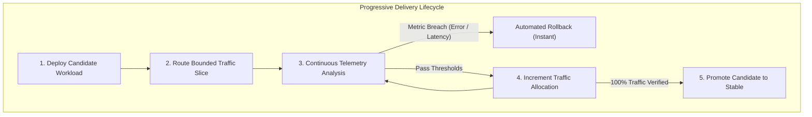
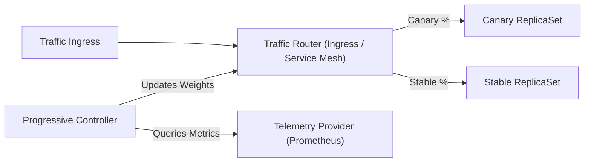

# Progressive Delivery Standards

Standards for canary deployments, metric-driven promotion gates, and automated blast-radius containment.

## What is Progressive Delivery?

Progressive delivery decouples software deployment from feature release, transforming continuous delivery into an automated, observable, and controlled progression. Rather than exposing 100% of user traffic to a newly deployed version simultaneously, progressive delivery deploys the new release alongside existing stable workloads, routes a tightly bounded initial slice of production traffic (e.g., 5%), continuously queries operational telemetry against statistical baselines, and advances traffic allocation through stepped stages (e.g., 25%, 50%, 100%). If telemetry detects latency spikes, error rate breaches, or downstream saturation, the system triggers an immediate, deterministic automated rollback with zero human intervention.

## Why it's required

- **Blast Radius Containment:** Operational defects, runtime panics, and edge-case exceptions are confined to a small fraction of live user requests (e.g., 5%), preventing fleet-wide outages.
- **Objective Metric-Driven Promotion:** Eliminates subjective manual verification and "stare-at-dashboards" fatigue by evaluating algorithmic PromQL and telemetry gates during active bake windows.
- **Deterministic Automated Rollback:** Resets ingress routing instantly to stable replicas upon threshold breach, achieving recovery times measured in seconds rather than prolonged incident escalation cycles.
- **Decoupled Verification from Exposure:** Allows operators and developers to verify live production behavior, database query performance, and memory stability under actual workload conditions before exposing the entire customer base.
- **Safe High-Velocity Shipping:** Provides the safety rails required for teams to ship multiple times per day without fear of catastrophic user impact.

## Who it's for

- **Platform & SRE Teams:** Designing standardized deployment controllers, traffic routing meshes, telemetry analysis templates, and automated blast-radius guardrails across the platform.
- **Service Owners & Application Developers:** Defining canary traffic steps, bake windows, error rate ceilings, and latency SLAs tailored to specific microservice workload characteristics.
- **Release Engineers:** Orchestrating continuous delivery pipelines, GitOps promotion triggers, and post-deployment validation workflows.

---

## Core Delivery Principles (Tool-Agnostic)

Progressive delivery is defined by fundamental architectural principles that apply universally, regardless of the underlying container orchestrator, traffic router, or telemetry provider:



1. **Decouple Deployment from Release:** Deploying application bits to runtime infrastructure must remain distinct from routing production user traffic to that code.
2. **Blast Radius Containment:** Traffic shifting begins at an isolated, minimal percentage (e.g., 5%) so that unexpected failures or regressions impact a negligible fraction of transactions.
3. **Objective Metric-Driven Verification:** Human observation is replaced by continuous statistical telemetry evaluations sampled during defined bake windows.
4. **Deterministic Automated Rollback:** When operational thresholds are breached, the delivery system reverts traffic to the baseline immediately without human approval or manual intervention.
5. **Dual-Version Backward Compatibility:** Stable and candidate versions must coexist concurrently in production, requiring database schemas, caches, and inter-service APIs to maintain backward compatibility across adjacent versions ($N$ and $N+1$).
6. **Declarative Progression State Machine:** The entire promotion sequence—traffic steps, pause intervals, analysis gates, and rollback policies—is declared as version-controlled code.

---

## Reference Implementation & Tool Selection Rationale

While delivery principles are universal, this playbook adopts **Argo Rollouts** for delivery lifecycle orchestration and **Prometheus** for telemetry evaluation as the primary cloud-native reference architecture.

### Why Argo Rollouts?

- **CNCF Graduated Maturity:** Argo is a CNCF Graduated project with proven enterprise reliability, active multi-vendor governance, and extensive production battle-testing at massive scale.
- **Native Kubernetes Custom Resource Definitions (CRDs):** Replaces standard `Deployment` objects with native `Rollout` and `AnalysisTemplate` CRDs, embedding delivery state directly into the Kubernetes API without requiring an external control plane.
- **Pluggable Traffic Router Support:** Integrates natively with Istio, Linkerd, NGINX Ingress, AWS ALB, Traefik, Envoy Gateway, and Gateway API through declarative configuration.
- **Declarative Step-Based Analysis:** Embeds inline and background telemetry validation runs directly into rollout steps, halting or aborting promotions with zero external scripts.
- **Active Community & Ecosystem:** First-class integration with GitOps engines (ArgoCD, Flux), CLI tooling, and web dashboards.

### Why Prometheus?

- **CNCF Graduated Standard:** De facto standard for Kubernetes metrics collection, scraping, and time-series storage.
- **Expressive PromQL Semantics:** Provides rich vector math and quantile functions (`histogram_quantile`, `rate`) required to compute P95/P99 latency ratios and error rate fractions across canary and stable replica sets.
- **Production SLO Parity:** Rollout analysis templates execute the identical PromQL expressions used for operational alerts and service level objectives, eliminating discrepancies between deployment gates and production monitoring.
- **Ubiquitous Native Support:** Natively supported out-of-the-box by Argo Rollouts, Flagger, and cloud-native ingress controllers without requiring external plugins or translation layers.

---

## Comparative Selection Matrix & Swap Guide

Organizations operating in diverse cloud environments or with existing vendor contracts can substitute components of the reference implementation without violating core delivery principles.

### Progressive Delivery Controllers

| Dimension | Argo Rollouts (Reference) | Flagger | Ingress-Native (e.g., NGINX, ALB) |
|---|---|---|---|
| **Resource Model** | Custom `Rollout` CRD (replaces `Deployment`) | Custom `Canary` CRD (wraps existing `Deployment`) | Standard `Deployment` + Ingress / Service annotations |
| **Traffic Routers** | Istio, Linkerd, NGINX, ALB, Traefik, Gateway API | Istio, Linkerd, App Mesh, NGINX, Gloo, Traefik, Gateway API | Ingress-specific (e.g., NGINX canary annotations, ALB weights) |
| **Analysis Engine** | Built-in `AnalysisTemplate` (10+ metric providers) | Built-in metric templates & webhooks | External CI/CD scripts or webhook pollers |
| **Rollback Latency** | Sub-second (controller resets router weights directly) | Sub-second (controller loops back to primary) | Seconds to minutes (driven by pipeline rerun or script execution) |
| **GitOps Fit** | Native (ArgoCD UI extension, health checks) | Excellent (designed for Flux; works with ArgoCD) | Moderate (requires managing two deployments or mutating annotations) |
| **Operational Overhead**| Controller deployment + CRD installation | Controller deployment + CRD installation | Zero in-cluster controller; high CI/CD pipeline scripting complexity |
| **Best Suited For** | Kubernetes platforms using ArgoCD or GitOps with CRDs | Platforms using Flux or teams mandating standard `Deployment` CRDs | Lightweight environments without cluster CRD install permissions |

#### Controller Swap Guide

- **Swapping Argo Rollouts to Flagger:**
  1. *Restore Standard Deployments:* Replace `kind: Rollout` with a standard `apps/v1` `Deployment` manifest.
  2. *Declare Canary Resource:* Create a `flagger.app/v1beta1` `Canary` CRD referencing the deployment target, defining `analysis.interval`, `analysis.threshold`, `analysis.stepWeight`, and `analysis.metrics`.
  3. *Automate Service Discovery:* Flagger generates `-primary` and `-canary` internal services automatically; update upstream ingress to route through the Flagger-managed primary service.
  4. *Port Analysis Queries:* Translate `AnalysisTemplate` PromQL queries into Flagger `MetricTemplate` resources or built-in metric checks (`request-success-rate`, `request-duration`).

- **Swapping Argo Rollouts to Ingress-Native Canary:**
  1. *Dual Deployment Strategy:* Maintain two standard `Deployment` resources: `<service>-stable` and `<service>-canary`.
  2. *Ingress Annotations:* Define a primary ingress pointing to stable, and a canary ingress annotated with traffic-split rules (e.g., `nginx.ingress.kubernetes.io/canary: "true"` and `nginx.ingress.kubernetes.io/canary-weight: "5"`).
  3. *Orchestrate via CI/CD:* Execute progression steps and bake windows in the deployment pipeline (e.g., GitHub Actions workflow), querying Prometheus via CLI/curl between steps.
  4. *Automate Rollback:* Configure pipeline failure traps to immediately set `canary-weight: "0"` or delete the canary ingress upon metric threshold violation.

---

### Telemetry & Metrics Providers

| Dimension | Prometheus (Reference) | Datadog | Cloud Monitoring / OpenTelemetry |
|---|---|---|---|
| **Query Language** | PromQL (vector operations, quantiles, rates) | Datadog Metric Query Syntax (`avg:`, `sum:`, `p99:`) | MQL / CloudWatch Metric Math / OTel PromQL endpoints |
| **Latency / Freshness** | Real-time (10–15s scrape interval, instant index) | Near real-time (15–60s ingest & aggregation delay) | 30–120s ingestion latency depending on cloud provider |
| **Cost Model** | Open-source infrastructure cost (RAM / persistent disk) | Commercial SaaS (per-host, per-custom-metric fees) | Cloud provider per-metric and per-API-call billing |
| **Authentication** | In-cluster service URL (Kubernetes RBAC or internal) | Secret-based `DD_API_KEY` and `DD_APP_KEY` | Cloud IAM (Workload Identity, IRSA, Managed Identity) |
| **Best Suited For** | Cloud-native Kubernetes clusters; unified Prometheus stack | Organizations with enterprise Datadog APM contracts | Managed cloud platforms (GKE, EKS, AKS) minimizing self-hosted tools |

#### Telemetry Provider Swap Guide

- **Swapping Prometheus to Datadog:**
  1. *Secret Configuration:* Store Datadog API and application keys in a Kubernetes secret (e.g., `datadog-secret` with `api-key` and `app-key`).
  2. *Controller Configuration:* Configure the rollout controller args to authenticate with the Datadog API endpoint.
  3. *Update AnalysisTemplate:* Replace the `provider.prometheus` block with `provider.datadog`:

     ```yaml
     provider:
       datadog:
         interval: 60s
         query: |
           sum:trace.http.request.errors{env:prod,service:payments-service,version:canary}.as_count()
           /
           sum:trace.http.request.hits{env:prod,service:payments-service,version:canary}.as_count()
     ```

  4. *Evaluate Threshold:* Ensure `successCondition: result < 0.001` matches Datadog's scalar response format.

- **Swapping Prometheus to Cloud Monitoring / OpenTelemetry:**
  1. *OpenTelemetry Collector (Prometheus-compatible):* If exporting OTel metrics to a Prometheus-compatible storage backend (e.g., Google Managed Service for Prometheus, AWS Managed Prometheus, Thanos, Cortex), retain the `prometheus` provider and update the `address` to point to the query proxy URL.
  2. *AWS CloudWatch:* In Argo Rollouts, replace the provider with `provider.cloudWatch`, specifying `metricDataQueries` using CloudWatch metric math.
  3. *Google Cloud Monitoring:* Utilize the OpenTelemetry / Prometheus query gateway or the `provider.web` HTTP plugin to invoke the Cloud Monitoring `timeSeries.query` endpoint.
  4. *Zero Static Credentials:* Ensure controllers use Workload Identity (GCP) or IAM Roles for Service Accounts (AWS IRSA) to query cloud monitoring APIs securely.

---

## Traffic Shifting & Progression Models

Progressive delivery engines must implement stepped traffic routing through an ingress controller, service mesh, or cloud load balancer.

### Canary Progression Steps & Bake Windows

All production canary rollouts must follow a four-tier stepped progression. Direct jumps from 0% to 100% are strictly prohibited for production environments.

| Progression Step | Traffic Allocation | Minimum Bake Duration | Primary Validation Objective |
|---|---|---|---|
| **Phase 1: Seed** | 5% | 10 minutes | Runtime initialization, panic detection, immediate crash loops |
| **Phase 2: Initial** | 25% | 15 minutes | Early throughput verification, downstream dependency capacity |
| **Phase 3: Half-Load** | 50% | 20 minutes | P95/P99 latency stability, connection pool saturation |
| **Phase 4: Full** | 100% | 15 minutes | Final verification before stable replica set decommissioning |

Total minimum bake duration for a complete production canary progression is **60 minutes**. Lower environments (development and staging) may compress bake windows to 2–5 minutes per step.

### Blue-Green Cutover Criteria

Blue-green deployments maintain two identical environments: active (`blue`) and preview (`green`). Blue-green is required when service workloads exhibit breaking state transitions, database schema lock sensitivity, or long-lived asynchronous batch jobs that cannot tolerate canary traffic splitting.

Cutover from preview to active must satisfy the following deterministic criteria:

1. **Synthetic Verification**: 100% of pre-cutover smoke tests against the preview endpoint pass.
2. **Readiness Parity**: 100% of preview pods report healthy readiness probes for a minimum of 180 seconds.
3. **Instantaneous Atomic Cutover**: Ingress or service selector updates atomically to route 100% of live traffic to the preview environment.
4. **Teardown Delay**: The retired stable environment must remain running in an idle state for a minimum of 30 minutes to facilitate instant zero-rebuild rollback if post-cutover regressions occur.

---

## Telemetry-Driven Automated Rollback

Rollout progression must be coupled to real-time telemetry analysis. Analysis templates must execute automated PromQL queries during every bake window.

### PromQL Error Rate Ceilings

The HTTP 5xx error rate ceiling for canary pods must remain strictly below **0.1%** ($< 0.001$ of total requests). Any sustained breach triggers an immediate rollback.

```promql
sum(rate(http_requests_total{job="workload-service",status=~"5..",version="canary"}[2m]))
/
sum(rate(http_requests_total{job="workload-service",version="canary"}[2m]))
  >= 0.001
```

For services with intermittent traffic, an absolute minimum request threshold must be included to avoid false-positive division-by-zero or small-sample anomalies:

```promql
(
  sum(rate(http_requests_total{job="workload-service",status=~"5..",version="canary"}[2m]))
  /
  sum(rate(http_requests_total{job="workload-service",version="canary"}[2m]))
) >= 0.001
and
sum(rate(http_requests_total{job="workload-service",version="canary"}[2m])) > 10
```

### P95 & P99 Latency Baselines

Canary latency degradation must not exceed **1.15x** ($\le 15\%$ increase) of the stable baseline latency across equivalent percentiles:

```promql
histogram_quantile(0.99, sum(rate(http_request_duration_seconds_bucket{job="workload-service",version="canary"}[2m])) by (le))
>
(
  1.15 * histogram_quantile(0.99, sum(rate(http_request_duration_seconds_bucket{job="workload-service",version="stable"}[2m])) by (le))
)
```

### Analysis Evaluation Contracts

Automated analysis must adhere to the following configuration constraints:

- **Sampling Interval**: Metrics sampled every 30 to 60 seconds.
- **Failure Threshold**: Rollback triggers on **2 consecutive failed metric checks** or a cumulative failure count exceeding 3 across the entire rollout lifecycle.
- **Warmup Grace Period**: Metric evaluation starts 60 seconds after pods transition to `Ready` to prevent false positives from JIT compilation, cold start cache misses, or connection initialization.

---

## Reference Configuration Examples

The reference implementations demonstrate declarative progressive delivery configurations using the standardized core abstractions:



### Implementation 1: Argo Rollouts

Argo Rollouts replaces the standard Kubernetes `Deployment` with a custom `Rollout` resource, orchestrating canary traffic and analysis execution.

```yaml
apiVersion: argoproj.io/v1alpha1
kind: Rollout
metadata:
  name: payments-service
  namespace: production
spec:
  replicas: 10
  strategy:
    canary:
      canaryService: payments-service-canary
      stableService: payments-service-stable
      trafficRouting:
        istio:
          virtualService:
            name: payments-vservice
            routes:
              - primary
      analysis:
        templates:
          - templateName: payments-success-rate
        args:
          - name: service-name
            value: payments-service
      steps:
        - setWeight: 5
        - pause: { duration: 10m }
        - setWeight: 25
        - pause: { duration: 15m }
        - setWeight: 50
        - pause: { duration: 20m }
        - setWeight: 100
        - pause: { duration: 15m }
```

Accompanying `AnalysisTemplate` resource:

```yaml
apiVersion: argoproj.io/v1alpha1
kind: AnalysisTemplate
metadata:
  name: payments-success-rate
  namespace: production
spec:
  metrics:
    - name: error-rate-ceiling
      interval: 60s
      successCondition: result[0] < 0.001
      failureLimit: 2
      provider:
        prometheus:
          address: http://prometheus-k8s.monitoring.svc:9090
          query: |
            sum(rate(http_requests_total{job="payments-service",status=~"5..",version="canary"}[2m]))
            /
            sum(rate(http_requests_total{job="payments-service",version="canary"}[2m]))
```

### Implementation 2: Flagger

Flagger coordinates progressive delivery using standard Kubernetes `Deployment` resources and a custom `Canary` resource, supporting various mesh and ingress providers.

```yaml
apiVersion: flagger.app/v1beta1
kind: Canary
metadata:
  name: order-service
  namespace: production
spec:
  targetRef:
    apiVersion: apps/v1
    kind: Deployment
    name: order-service
  service:
    port: 8080
    targetPort: 8080
  analysis:
    interval: 1m
    threshold: 2
    maxWeight: 100
    stepWeight: 25
    metrics:
      - name: request-success-rate
        thresholdRange:
          min: 99.9
        interval: 1m
        templateRef:
          name: success-rate-template
      - name: request-duration
        thresholdRange:
          max: 500
        interval: 1m
        templateRef:
          name: latency-template
```

### Implementation 3: Service Mesh Routing (Istio & Linkerd)

Traffic splitting relies on declarative service mesh primitives to slice traffic independent of replica count:

- **Istio `VirtualService`**: Declares weight distribution between `subset: stable` and `subset: canary` destinations.
- **Linkerd `TrafficSplit`**: Slices HTTP traffic between leaf backend services according to integer weights conforming to the Service Mesh Interface (SMI) specification.

```yaml
apiVersion: split.smi-spec.io/v1alpha2
kind: TrafficSplit
metadata:
  name: catalog-service-split
  namespace: production
spec:
  service: catalog-service
  backends:
    - service: catalog-service-stable
      weight: 750m
    - service: catalog-service-canary
      weight: 250m
```

---

## Operational Checklist & Anti-Patterns

### Pre-Deployment Verification Checklist

- [ ] Workload is completely stateless or adheres to backward-compatible database schema evolution.
- [ ] Canary and stable services declare identical `PodDisruptionBudget` and resource reservations.
- [ ] PromQL queries in analysis templates have been tested against live Prometheus endpoints in staging.
- [ ] Fallback traffic routing is configured to instantly recover stable service if the rollout controller crashes.
- [ ] Active telemetry queries include sample-size guards (`> 10 req/sec`) to avoid zero-division errors during off-peak hours.

### Release Engineering Anti-Patterns

| Anti-Pattern | Operational Risk | Standard Compliance |
|---|---|---|
| **Manual Promotion Overrides** | Human fatigue and biased judgment overlook subtle error rate regressions. | Mandatory automated metric analysis determines step promotion. |
| **Omitting Latency Checks** | Rollout succeeds while memory leaks or thread locks double response times. | Analysis templates must evaluate both error rates and P95/P99 latency baselines. |
| **Instant 0% to 100% Cutover** | Undetected bugs cause instantaneous full-scale outage. | Minimum 4-step progressive canary progression required for Tier 1/2 services. |
| **In-Process Schema Migrations** | New schema breaks running stable pods during canary execution. | Database migrations must execute via isolated pre-upgrade jobs with backward compatibility. |
