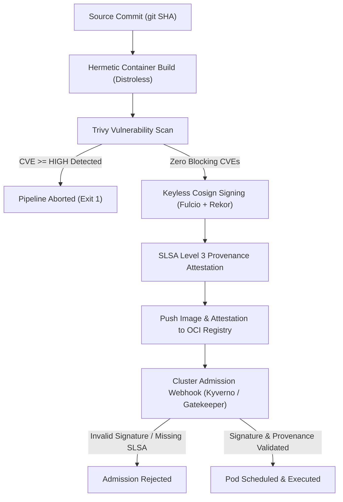

# Software Supply Chain Security Standards

Standards for container provenance, cryptographic attestation, image signing, and admission control.

## What is Supply Chain Security?

Software supply chain security encompasses the practices, cryptographic tooling, and verification gates that protect every stage of the software delivery lifecycle — from source code commits and third-party dependencies through container builds, packaging, registry distribution, and cluster runtime admission. It ensures that only verified, untampered artifacts built by authorized continuous integration pipelines from vetted source repositories are permitted to run in production environments.

## Why it's required

- **Zero-Trust Artifact Integrity:** Guarantees that container images deployed in production originate exclusively from trusted source repositories and automated CI workflows, preventing unauthorized tampering.
- **Dependency & Vulnerability Mitigation:** Prevents compromised third-party packages, backdoored base images, and unpatched CVEs from entering production clusters through automated pre-signing scanning gates.
- **Non-Repudiation & Traceability:** Uses keyless cryptographic signatures and public transparency logs to bind every artifact irrevocably to a verifiable developer identity, commit SHA, and build invocation.
- **Fail-Closed Admission Enforcement:** Eliminates reliance on developer diligence or CI checks alone by enforcing cryptographic signature and provenance validation at the Kubernetes admission controller level.
- **Regulatory & Compliance Assurance:** Generates verifiable, tamper-evident audit trails (SLSA Level 3 provenance, Rekor logs) that satisfy SOC2, FedRAMP, and NIST SP 800-218 requirements.

## Who it's for

- **Security Engineers & SecOps:** Architects defining cryptographic attestation requirements, keyless Sigstore trust policies, and vulnerability threshold gates.
- **Platform & Release Engineers:** SREs configuring GitHub Actions CI/CD pipelines, Cosign signing workflows, SLSA provenance generators, and in-cluster admission controllers (Kyverno, Gatekeeper).
- **Software Engineers:** Developers authoring application code, curating minimal distroless container builds, and remediating high/critical CVE dependencies before promotion.
- **Compliance & Audit Teams:** Assessors verifying verifiable provenance proofs, image digests, and immutable transparency log entries across releases.

---

## Key Business Drivers

| Driver | Outcome |
|--------|---------|
| **Zero Trust Integrity** | Guarantees container images running in production originate from trusted, verified source repositories |
| **Non-Repudiation** | Keyless cryptographic signatures bind artifacts to verified CI/CD workflows and developer identities |
| **Proactive Vulnerability Gate** | Automated scanning prevents images with high and critical CVEs from reaching signature or deployment phases |
| **Policy-Driven Admission** | In-cluster admission controllers reject unsigned images or tampering attempts before pod execution |
| **Auditability & Compliance** | Cryptographic transparency logs (Rekor) provide verifiable audit trails satisfying SOC2, PCI-DSS, and FedRAMP |

---

## Core Principles

### 1. Cryptographic Attestation

Every container image must possess immutable, cryptographic proof of its source code origin, build pipeline, dependencies, and vulnerability posture. Metadata cannot rely on mutable tags; all attestations bind directly to immutable cryptographic image digests (`sha256:...`).

### 2. Keyless Ephemeral Signing

Static, long-lived private signing keys are **strictly forbidden**. Storing private keys in CI/CD secrets exposes the supply chain to credential theft and rotation overhead. Signing must leverage **Sigstore keyless infrastructure**, using OpenID Connect (OIDC) federated identity tokens to issue short-lived X.509 certificates.

### 3. Fail-Closed Admission Gate Enforcement

Security guarantees cannot depend entirely on CI/CD pipelines. The runtime Kubernetes control plane must actively enforce signature and attestation verification at the admission controller. If an image lacks a valid cryptographic signature or SLSA provenance attestation, the admission webhook must block container creation (`fail-closed`).

---

## Supply Chain Pipeline Architecture

Artifacts transition through sequential verification and attestation phases before reaching the runtime cluster:



---

## Vulnerability Scanning Gate (Trivy)

All container images must be scanned for operating system and application dependency vulnerabilities prior to cryptographic signing. Signing an image with known, unpatched high-risk vulnerabilities is prohibited.

### Enforcement Rules

- **Severity Blocking Threshold**: Pipelines must fail and abort on any CVE with severity `HIGH` or `CRITICAL`.
- **Pre-Signing Execution**: Scanning occurs strictly before `cosign sign`. Once signed, an image must be immutable and clean.
- **Minimal Attack Surface**: Images must be built from minimal, distroless base images (e.g., GoogleContainerTools distroless, Wolfi) running as non-root (UID 65534).

### GitHub Actions Trivy Gate Manifest

```yaml
- name: Run Trivy Vulnerability Scanner
  uses: aquasecurity/trivy-action@0.29.0
  with:
    image-ref: ${{ env.IMAGE_REGISTRY }}/${{ env.IMAGE_NAME }}@${{ steps.build.outputs.digest }}
    format: "table"
    exit-code: "1"
    ignore-unfixed: false
    vuln-type: "os,library"
    severity: "HIGH,CRITICAL"
```

---

## Keyless Cosign Signing with Sigstore

Signing is executed using Sigstore Cosign via GitHub Actions Workload Identity (OIDC).

### Signature Components

1. **OIDC Provider**: GitHub Actions issues a short-lived OIDC JWT token containing identity claims (repository, workflow, Git ref, commit SHA).
2. **Fulcio Certificate Authority**: Exchanges the OIDC token for an ephemeral X.509 signing certificate valid for 10 minutes.
3. **Cosign Client**: Generates an ephemeral key pair in memory, signs the OCI image digest, and discards the private key.
4. **Rekor Transparency Log**: Stores an immutable, publicly verifiable record of the signature and certificate transparency proof.

### Signing Workflow Implementation

Workflows executing signing must declare explicit minimal OIDC permissions (`id-token: write` and `contents: read`):

```yaml
permissions:
  contents: read
  id-token: write
  packages: write

steps:
  - name: Install Cosign
    uses: sigstore/cosign-installer@v3.8.1

  - name: Sign Container Image (Keyless)
    env:
      COSIGN_EXPERIMENTAL: "1"
    run: |
      cosign sign --yes \
        "${{ env.IMAGE_REGISTRY }}/${{ env.IMAGE_NAME }}@${{ steps.build.outputs.digest }}"
```

### Verification Command

Signatures are verified without static keys by asserting certificate identity and issuer regex:

```bash
cosign verify \
  --certificate-identity-regexp "^https://github.com/mahpatil/.*$" \
  --certificate-oidc-issuer "https://token.actions.githubusercontent.com" \
  "${IMAGE_REF}@${IMAGE_DIGEST}"
```

---

## SLSA Level 3 Build Provenance

Supply chain integrity requires non-falsifiable build provenance meeting **SLSA (Supply-chain Levels for Software Artifacts) Level 3**.

### Required Provenance Properties

- **Isolated Build Environment**: Builds execute on isolated ephemeral runners where developers cannot inject arbitrary external binaries during artifact construction.
- **Cryptographic Provenance**: Provenance payload generated in `in-toto` specification format recording:
  - Builder ID (canonical GitHub Actions reusable workflow URL).
  - Source repository URL and resolved commit SHA.
  - Complete invocation parameters and dependencies.
- **Non-Falsifiable Identity**: The build system itself generates and signs the provenance attestation, preventing pipeline scripts from modifying build claims.

### Provenance Generation & Verification

Builds utilize the official SLSA GitHub Actions generator:

```yaml
provenance:
  needs: [build-and-push]
  permissions:
    id-token: write
    contents: read
    actions: read
  uses: slsa-framework/slsa-github-generator/.github/workflows/generator_container_slsa3.yml@v2.1.0
  with:
    image: ${{ needs.build-and-push.outputs.image }}
    digest: ${{ needs.build-and-push.outputs.digest }}
    registry-username: ${{ github.actor }}
  secrets:
    registry-password: ${{ secrets.GITHUB_TOKEN }}
```

Verification validates the provenance attestation payload:

```bash
cosign verify-attestation \
  --type slsaprovenance \
  --certificate-identity-regexp "^https://github.com/slsa-framework/slsa-github-generator/.*$" \
  --certificate-oidc-issuer "https://token.actions.githubusercontent.com" \
  "${IMAGE_REF}@${IMAGE_DIGEST}"
```

---

## Cluster Admission Enforcement

Policy engines deployed within Kubernetes clusters intercept pod creation requests and evaluate admission rules.

### Kyverno Policy Enforcement

Kyverno validates image signatures and attestation identities against Fulcio and Rekor before pod admittance:

```yaml
apiVersion: kyverno.io/v1
kind: ClusterPolicy
metadata:
  name: enforce-signed-images
  annotations:
    policies.kyverno.io/title: Verify Image Signatures & Attestations
    policies.kyverno.io/severity: high
spec:
  validationFailureAction: Enforce
  webhookTimeoutSeconds: 30
  rules:
    - name: verify-sigstore-signature
      match:
        any:
          - resources:
              kinds:
                - Pod
      verifyImages:
        - imageReferences:
            - "ghcr.io/mahpatil/*"
          attestors:
            - entries:
                - keyless:
                    issuer: "https://token.actions.githubusercontent.com"
                    subjectRegExp: "^https://github.com/mahpatil/.*$"
                    rekor:
                      url: "https://rekor.sigstore.dev"
```

### OPA / Gatekeeper Enforcement Pattern

Organizations standardizing on Open Policy Agent (OPA) Gatekeeper implement equivalent constraints through `ConstraintTemplate` manifests executing Rego verification against external Cosign validation sidecars or OCI metadata mirrors.

### Rollout Lifecycle

1. **Audit Mode (`validationFailureAction: Audit`)**: Deployed initially for 14 days across staging environments to detect unsigned auxiliary or sidecar containers without blocking deployments.
2. **Enforce Mode (`validationFailureAction: Enforce`)**: Locked across production clusters. Any pod failing signature or attestation verification is rejected immediately with an HTTP 403 API response.

---

## Operational Verification Checklist

Before publishing or deploying container images, confirm that all security controls pass:

- [ ] **Distroless Base**: Base image contains zero system package managers (apt, apk, yum) and runs as non-root UID 65534.
- [ ] **Vulnerability Gate Clean**: Trivy scan reports zero unfixed `HIGH` or `CRITICAL` vulnerabilities with exit code 0.
- [ ] **Digest Immutability**: Deployment manifests and Helm values reference immutable digest pins (`@sha256:...`) instead of mutable tags.
- [ ] **Keyless Signing**: Image signature successfully recorded on public Rekor transparency log.
- [ ] **SLSA Provenance Bound**: SLSA Level 3 provenance attestation generated by trusted builder workflow and attached to OCI registry.
- [ ] **Admission Enforced**: In-cluster admission controller (Kyverno or Gatekeeper) set to `Enforce` mode.
