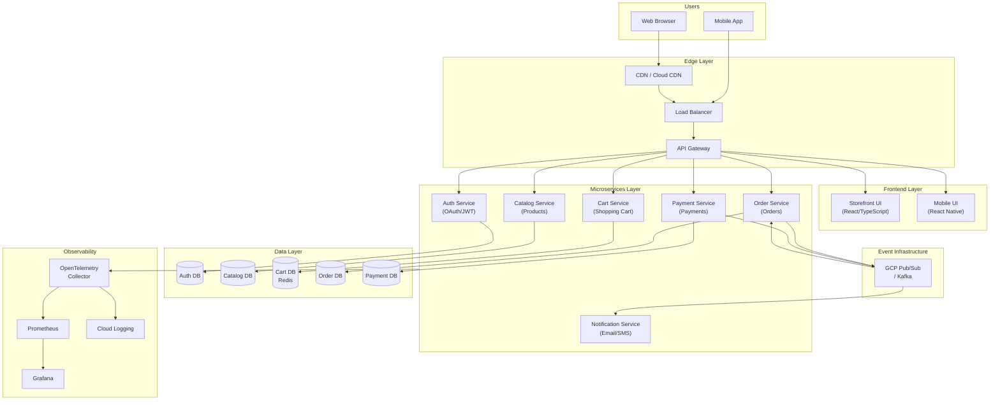
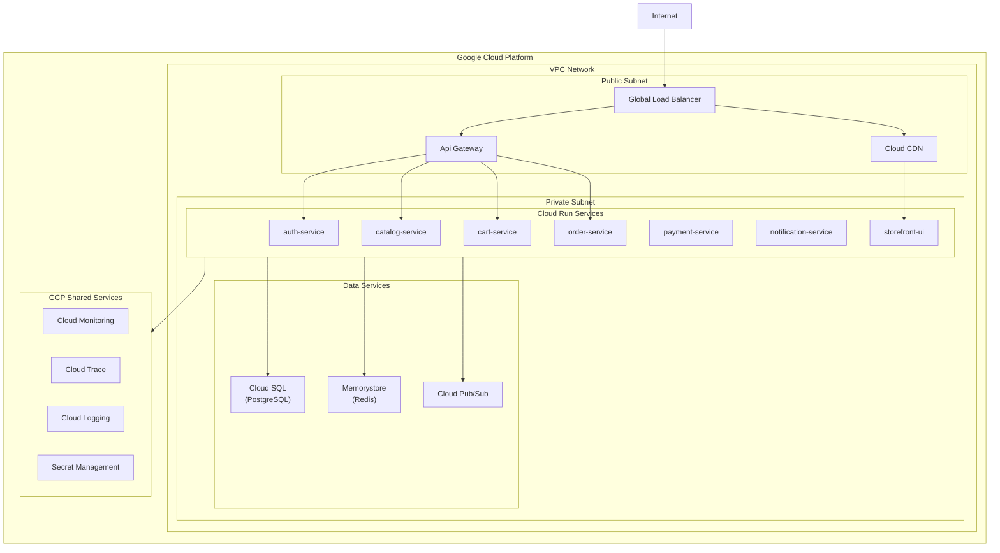
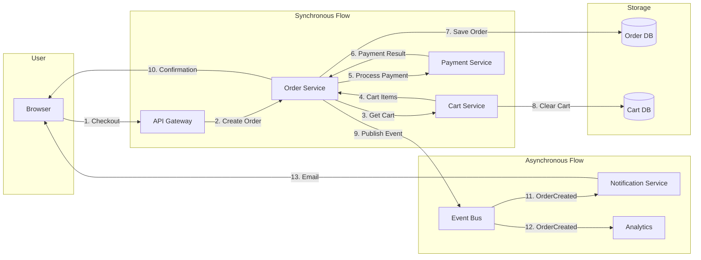
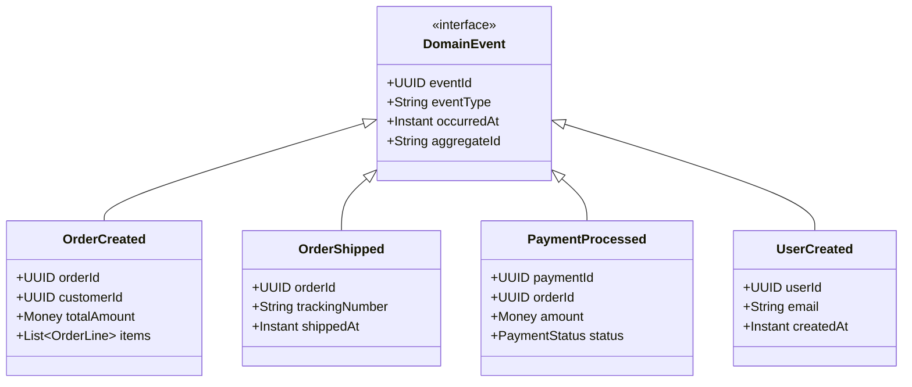
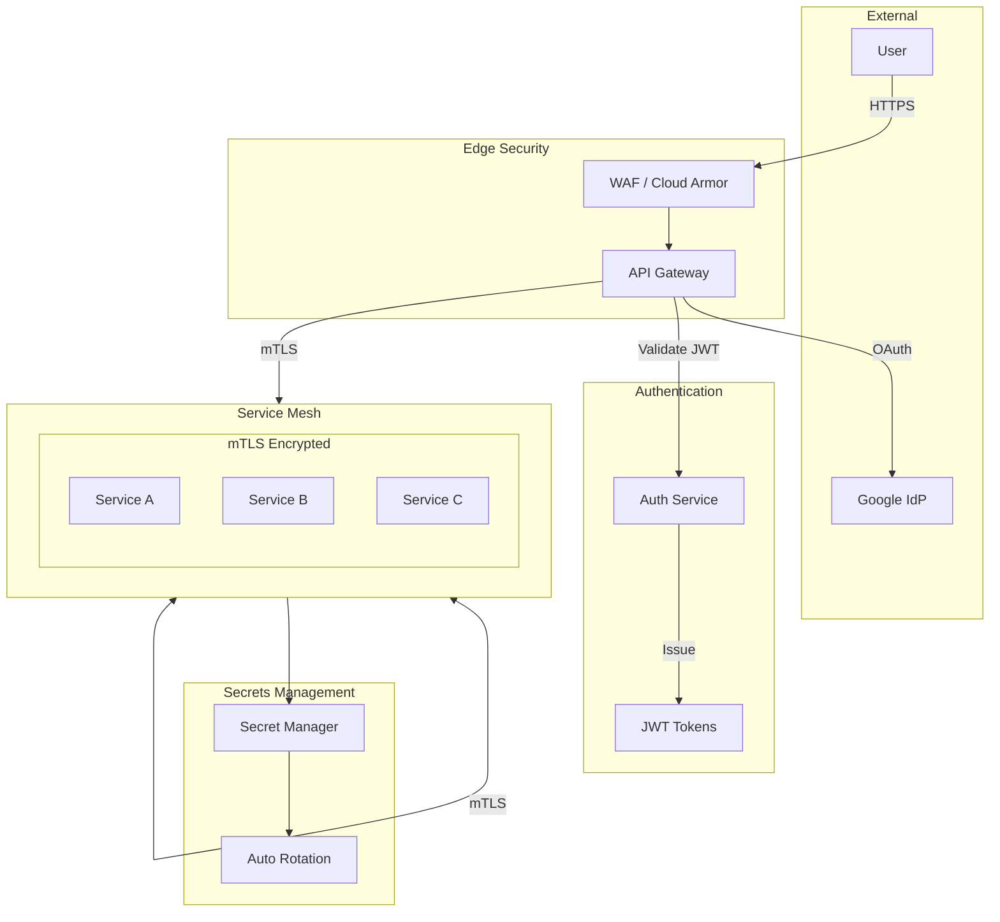
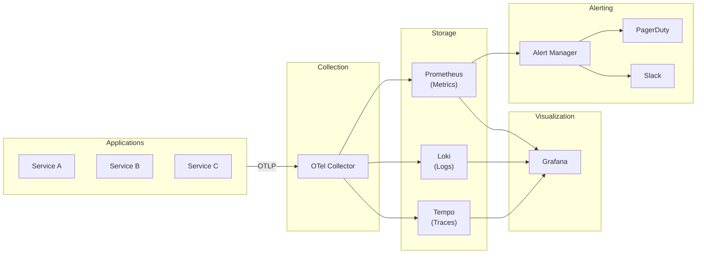
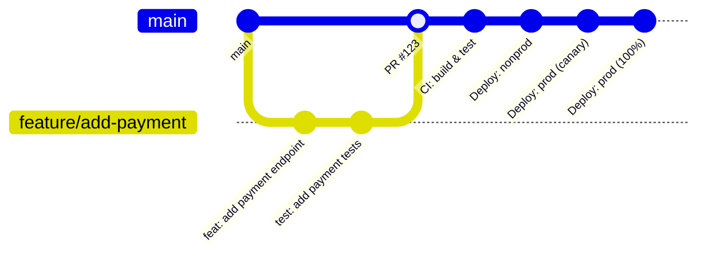

# Sample Application Architecture

Reference architecture for a cloud-native e-commerce platform demonstrating the standards in practice.

---

## System Overview

A full-stack e-commerce demonstration featuring microservices (Java 21/Spring Boot) and React frontend with Google OAuth and local authentication. Supports deployment on both local Kind clusters and GCP Cloud Run.



---

## Project Structure

### Repository Layout

```
├── .github/                     # GitHub Actions workflows
│   └── workflows/
│       ├── ci.yml               # PR validation
│       ├── build.yml            # Build and test
│       ├── security.yml         # Security scans
│       └── deploy.yml           # Deployment
│
├── services/                    # Backend Microservices
│   ├── auth-service/            # Authentication & Authorization
│   │   ├── src/main/java/
│   │   │   ├── domain/          # Core business logic
│   │   │   ├── application/     # Use cases
│   │   │   ├── infrastructure/  # Adapters
│   │   │   └── api/             # REST controllers
│   │   ├── src/test/
│   │   ├── build.gradle
│   │   └── Dockerfile
│   │
│   ├── catalog-service/         # Product catalog
│   ├── cart-service/            # Shopping cart
│   ├── order-service/           # Order management
│   ├── payment-service/         # Payment processing
│   ├── notification-service/    # Notifications
│   │
│   └── libs/                    # Shared libraries
│       ├── jwt-common/          # JWT utilities
│       ├── event-common/        # Event schemas
│       └── observability/       # OTel configuration
│
├── ui/                          # Frontend Applications
│   ├── storefront-ui/           # React + TypeScript (Vite)
│   │   ├── src/
│   │   │   ├── api/             # API clients
│   │   │   ├── components/      # UI components
│   │   │   ├── features/        # Feature modules
│   │   │   ├── hooks/           # Custom hooks
│   │   │   └── pages/           # Route components
│   │   ├── package.json
│   │   └── vite.config.ts
│   │
│   ├── mobile-ui/               # React Native
│   └── commons/                 # Shared UI libraries
│
├── infra/                       # Infrastructure as Code
│   ├── terraform/               # GCP resources
│   │   ├── modules/
│   │   │   ├── cloudrun/
│   │   │   ├── cloudsql/
│   │   │   ├── pubsub/
│   │   │   └── networking/
│   │   ├── environments/
│   │   │   ├── nonprod/
│   │   │   └── prod/
│   │   └── main.tf
│   │
│   └── k8s/                     # Kubernetes manifests
│       ├── base/                # Base configurations
│       ├── overlays/
│       │   ├── local/           # Kind cluster
│       │   ├── nonprod/
│       │   └── prod/
│       └── kustomization.yaml
│
├── docs/                        # Documentation
│   ├── adr/                     # Architecture Decision Records
│   ├── api/                     # API documentation
│   └── runbooks/                # Operational runbooks
│
└── scripts/                     # Utility scripts
    ├── local-setup.sh
    └── deploy.sh
```

---

## Service Details

### Service Matrix

| Service | Responsibilities | Database | Events Published | Events Consumed |
|---------|-----------------|----------|------------------|-----------------|
| auth-service | OAuth, JWT, User mgmt | PostgreSQL | UserCreated, UserLoggedIn | - |
| catalog-service | Products, Categories, Search | PostgreSQL | ProductUpdated | - |
| cart-service | Shopping cart, Sessions | Redis | CartUpdated | UserLoggedIn |
| order-service | Orders, Order history | PostgreSQL | OrderCreated, OrderShipped | PaymentProcessed |
| payment-service | Payment processing | PostgreSQL | PaymentProcessed, PaymentFailed | OrderCreated |
| notification-service | Email, SMS, Push | - | - | OrderCreated, PaymentProcessed |

---

## Deployment Architecture

### GCP Cloud Run Deployment



---

## Data Flow

### Order Processing Flow



---

## Event Schema

### Domain Events



---

## API Structure

### RESTful Endpoints

```
Auth Service
├── POST   /api/v1/auth/login
├── POST   /api/v1/auth/register
├── POST   /api/v1/auth/refresh
├── GET    /api/v1/auth/oauth/google
└── GET    /api/v1/users/me

Catalog Service
├── GET    /api/v1/products
├── GET    /api/v1/products/{id}
├── GET    /api/v1/products/search?q=
├── GET    /api/v1/categories
└── GET    /api/v1/categories/{id}/products

Cart Service
├── GET    /api/v1/cart
├── POST   /api/v1/cart/items
├── PUT    /api/v1/cart/items/{id}
├── DELETE /api/v1/cart/items/{id}
└── DELETE /api/v1/cart

Order Service
├── POST   /api/v1/orders
├── GET    /api/v1/orders
├── GET    /api/v1/orders/{id}
└── POST   /api/v1/orders/{id}/cancel

Payment Service
├── POST   /api/v1/payments
├── GET    /api/v1/payments/{id}
└── POST   /api/v1/payments/{id}/refund
```

---

## Security Architecture



---

## Observability Stack



---

## Development Workflow



---

## Getting Started

### Prerequisites
```bash
# Required tools
java --version    # Java 21+
node --version    # Node.js LTS
docker --version  # Docker
kubectl version   # kubectl
kind version      # Kind (optional)
```

### Local Development
```bash
# Clone repository
git clone https://github.com/org/ecommerce-platform.git
cd ecommerce-platform

# Start infrastructure
docker-compose up -d

# Start backend service
cd services/catalog-service
./gradlew bootRun

# Start frontend
cd ui/storefront-ui
npm install && npm run dev
```

### Local Kubernetes
```bash
# Create Kind cluster
kind create cluster --config infra/k8s/kind-config.yaml

# Deploy all services
kubectl apply -k infra/k8s/overlays/local/

# Port forward
kubectl port-forward svc/storefront-ui 3000:80
```

---

## Related Standards

- [PRINCIPLES.md](./PRINCIPLES.md) - Core engineering principles
- [PATTERNS.md](./PATTERNS.md) - DDD, Hexagonal, Event driven & Resilience patterns
- [TECHNOLOGY-STANDARDS.md](./TECHNOLOGY-STANDARDS.md) - Java/Spring, React standards
- [SECURITY-STANDARDS.md](./SECURITY-STANDARDS.md) - Security implementation
- [DEVOPS-STANDARDS.md](./DEVOPS-STANDARDS.md) - CI/CD pipelines
- [OBSERVABILITY-STANDARDS.md](./OBSERVABILITY-STANDARDS.md) - Monitoring setup
