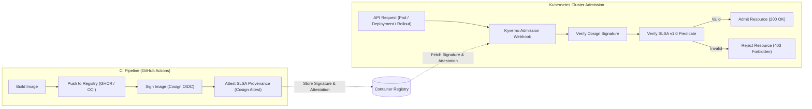

# Supply Chain Security & Admission Control Templates

Production-grade templates for establishing end-to-end cryptographic supply chain integrity, automated container image signing via Sigstore Cosign keyless OpenID Connect (OIDC), SLSA v1.0 build provenance attestation, and Kubernetes admission enforcement via Kyverno.

## Architecture



## Template Catalog

| Template | Kind | Description |
|:---|:---|:---|
| [`kyverno-cosign-verify.yaml`](./kyverno-cosign-verify.yaml) | `ClusterPolicy` | Kyverno policy enforcing keyless Cosign signature and SLSA provenance verification across protected namespaces. |
| [`cosign-slsa-actions.yml`](./cosign-slsa-actions.yml) | GitHub Actions | Reusable workflow building container images, signing with Cosign via keyless OIDC, and attesting SLSA provenance. |

## Quickstart & Configuration

### 1. Template Placeholders

Before deploying, substitute the placeholder tokens:

| Placeholder | Example Value | Description |
|:---|:---|:---|
| `{{GITHUB_ORG}}` | `my-org` | GitHub organization or user owning the workflow runner. |
| `{{IMAGE_REGISTRY}}` | `ghcr.io` | Fully qualified OCI registry domain. |
| `{{PROTECTED_NAMESPACE}}` | `production` | Target Kubernetes namespace where strict admission applies. |

### 2. Calling the Reusable Workflow

Integrate `cosign-slsa-actions.yml` in your application repository `.github/workflows/release.yml`:

```yaml
jobs:
  release-image:
    permissions:
      id-token: write
      contents: read
      packages: write
    uses: my-org/engineering-playbook/templates/supply-chain/cosign-slsa-actions.yml@main
    with:
      image-name: ghcr.io/my-org/payment-service
      image-tag: ${{ github.sha }}
      dockerfile: ./Dockerfile
```

## Verification & Testing

### 1. Manual Signature & Attestation Verification

Verify image signatures and SLSA provenance locally or in CI pipelines:

```bash
# Verify image signature with Cosign keyless OIDC
cosign verify \
  --certificate-identity-regexp="https://github.com/my-org/.*" \
  --certificate-oidc-issuer="https://token.actions.githubusercontent.com" \
  ghcr.io/my-org/payment-service@sha256:d5b5d122bf...

# Verify SLSA v1.0 provenance attestation
cosign verify-attestation \
  --type https://slsa.dev/provenance/v1 \
  --certificate-identity-regexp="https://github.com/my-org/.*" \
  --certificate-oidc-issuer="https://token.actions.githubusercontent.com" \
  ghcr.io/my-org/payment-service@sha256:d5b5d122bf...
```

### 2. Admission Policy Deployment

Apply the Kyverno ClusterPolicy to your target Kubernetes cluster:

```bash
# Apply policy
kubectl apply -f templates/supply-chain/kyverno-cosign-verify.yaml

# Verify policy readiness
kubectl get clusterpolicy check-image-signatures-and-provenance
```

### 3. Admission Behavior Testing

Validate enforcement by testing signed versus unsigned container images:

```bash
# Test 1: Deploy signed image with valid SLSA provenance (should succeed)
kubectl run valid-app \
  --image=ghcr.io/my-org/payment-service@sha256:d5b5d122bf... \
  --namespace=production

# Test 2: Deploy unsigned image (must be rejected by Kyverno admission)
kubectl run unsigned-app \
  --image=alpine:latest \
  --namespace=production
# Expected output:
# Error from server: admission webhook "validate.kyverno.svc" denied the request:
# resource Pod/production/unsigned-app was blocked.
```

## Troubleshooting Guide

### Missing OIDC Token in GitHub Actions

- **Symptom**: `cosign: error signing: no OIDC identity token found`.
- **Cause**: Workflow job missing required `id-token: write` permission.
- **Remediation**: Declare `permissions: id-token: write` at the job or workflow level.

### Certificate Subject Mismatch in Kyverno

- **Symptom**: Admission webhook rejects pod with `no matching signatures found`.
- **Cause**: The SAN certificate subject in Fulcio does not match `https://github.com/{{GITHUB_ORG}}/*`.
- **Remediation**: Check the repository or organization name in the workflow triggering the build.

### Missing SLSA Provenance Attestation

- **Symptom**: `failed to verify attestation: no matching attestations for type https://slsa.dev/provenance/v1`.
- **Cause**: Image was signed with `cosign sign` but missing `cosign attest`.
- **Remediation**: Ensure both signing and SLSA attestation steps complete before deployment.

### Webhook Timeout During Image Verification

- **Symptom**: `failed calling webhook "validate.kyverno.svc": context deadline exceeded`.
- **Cause**: Kyverno timed out querying Rekor transparency log or container registry.
- **Remediation**: Verify cluster egress connectivity to `rekor.sigstore.dev` and the registry, or adjust `webhookTimeoutSeconds: 30`.
